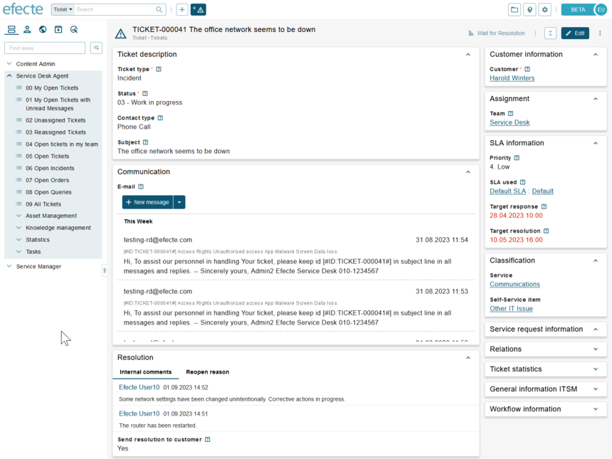

# ESM: Styling and accessibility improvements to the new datacard view

**Källa:** https://community.efecte.com/t/h7yql5q/esm-styling-and-accessibility-improvements-to-the-new-datacard-view
**Publicerad:** 2023-09-01T12:05:10.883Z
**Uppdaterad:** 2023-09-01T14:05:10.883000
**Författare:** 

---

ESM: Styling and accessibility improvements to the new datacard view

      
    
          
      

        
              Jonne KaukoProduct Manager
            

            Senior Product Manager & Product Lead, M42 Core & Pro
              Jonne_Kauko
            2 yrs agoFri, September 1, 2023 at 2:05 PM GMT+2
  

           Done
        

        
    
 Problem statement  
 The early access beta UI in ESM 2023.2 includes the first version of the new datacard view. Based on observations and feedback from user testing, it was found that the readability of the information was not optimal due to lack of separation of class names and attribute names and values, amongst other factors.   
 There were also some accessibility aspects, such as keyboard navigation and other technical accessibility topics, that required improvement.   
  Short description  
 A new iteration of the new datacard view layout has been designed and validated with end users. This roadmap item delivers the styling and accessibility improvements.    
   Use case details  
 The iterated design has a stronger distinction between the classes, new styling for the class names, and a stronger separation between the background and the classes. Also, there is a stronger distinction between the view and edit modes. Various accessibility improvements are also to be included.  
          
  Vote
  Follow
    
            2

## Bilder

