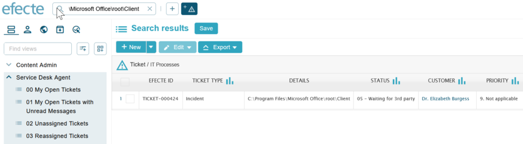

# ESM: Support for backslashes in global search

**Källa:** https://community.efecte.com/t/60yqlwn/esm-support-for-backslashes-in-global-search
**Publicerad:** 2023-09-01T14:27:54.067Z
**Uppdaterad:** 2023-09-01T16:27:54.067000
**Författare:** 

---

ESM: Support for backslashes in global search

      
    
          
      

        
              Jonne KaukoProduct Manager
            

            Senior Product Manager & Product Lead, M42 Core & Pro
              Jonne_Kauko
            2 yrs agoFri, September 1, 2023 at 4:27 PM GMT+2
  

           Done
        

        
    
 Problem Statement  
 When using global search in ESM, users currently face challenges when searching for data that includes backslashes, like file paths. Tickets might include file paths, and sometimes, service desk agents have difficulties in finding specific tickets when they only know the file path but no other details about the ticket.  
 Proposed Solution  
 We plan to introduce a solution that lets you search for data using file paths with backslashes in the global search. This means you can find the information you need more easily, like tickets related to specific file paths.   
 Use Case Details  
 With this solution, you'll be able to use global search to find data that includes backslashes. For example, if you're looking for a file path like "C:\Program Files\Microsoft Office\root\Client," you'll find the relevant information without any hassle.  
 Note! These changes will apply exclusively in cloud and private cloud installations (PostgreSQL databases), with MS SQL excluded from the scope of implementation. This implies that on-premise installations based on the MSSQL database are excluded from the scope of this improvement.   
  
   
          
  Vote
  Follow

## Bilder

