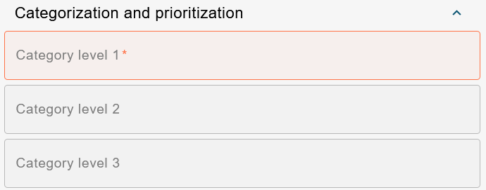

# ESM: Support for CategoryDropdownReference handler in the new datacard view

**Källa:** https://community.efecte.com/t/m1yqldb/esm-support-for-categorydropdownreference-handler-in-the-new-datacard-view
**Publicerad:** 2023-09-01T13:55:17.040Z
**Uppdaterad:** 2023-09-01T16:08:51.560000
**Författare:** 

---

ESM: Support for CategoryDropdownReference handler in the new datacard view

      
    
          
      

        
              Jonne KaukoProduct Manager
            

            Senior Product Manager & Product Lead, M42 Core & Pro
              Jonne_Kauko
            updated 2 yrs agoFri, September 1, 2023 at 4:08 PM GMT+2
  

           Done
        

        
    
 Problem statement  
 In the early access beta UI of ESM 2023.2, the datacard view presents a constrained selection of supported handlers and functionalities. Notably, one functionality that is currently missing is the CategoryDropdownReference handler, which is used for filtering reference values.  
  Short description  
 We are introducing an enhancement to address this issue. We are planning to introduce support for the CategoryDropdownReference handler within the newly implemented datacard view in the early access beta UI.  
  Use case details  
 The functionality of the CategoryDropdownReference handler in the new datacard view will mirror that of the current UI. This addition aims to maintain a consistent and familiar experience while enabling users to filter reference values effectively.  
   
          
  Vote
  Follow

## Bilder

