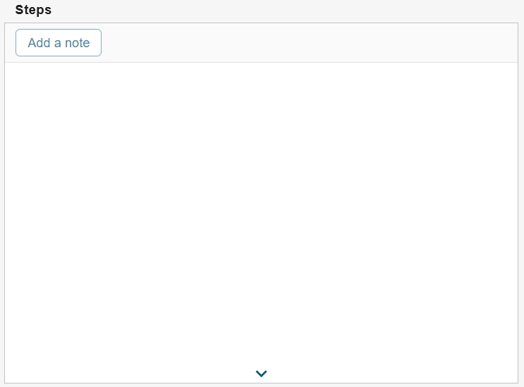
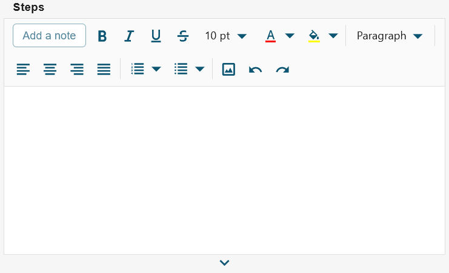

# ESM: Support for TextNote handler in the new datacard view

**Källa:** https://community.efecte.com/t/y4yqld1/esm-support-for-textnote-handler-in-the-new-datacard-view
**Publicerad:** 2023-09-01T13:52:54.600Z
**Uppdaterad:** 2023-09-01T16:10:24.067000
**Författare:** 

---

ESM: Support for TextNote handler in the new datacard view

      
    
          
      

        
              Jonne KaukoProduct Manager
            

            Senior Product Manager & Product Lead, M42 Core & Pro
              Jonne_Kauko
            updated 2 yrs agoFri, September 1, 2023 at 4:10 PM GMT+2
  

           Done
        

        
    
 Problem statement  
 Within the early access beta UI of ESM 2023.2, the datacard view offers a limited range of supported handlers and functionalities. One notable omission is the absence of the TextNote handler, which is essential for adding notes to text attributes.  
  Short description  
 We are introducing an enhancement to address this issue. We are planning to introduce support for the TextNote handler within the newly implemented datacard view in the early access beta UI.  
  Use case details  
 The functionality of the TextNote handler in the new datacard view will closely align with that of the current UI. However, we are making an improvement in the positioning of the "Add a note" button. Instead of being located outside the attribute area, it will now reside inside the attribute area, positioned above the content. Notably, the TextNote handler will seamlessly function both with and without the enhanced rich text editor, ensuring versatility and usability.  
 TextNote without rich text editor:  
   
 TextNote with rich text editor:  
    
          
  Vote
  Follow

## Bilder

