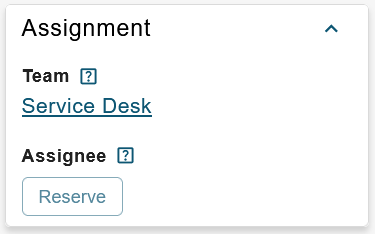

# ESM: Support for TicketReservation button in new datacard view

**Källa:** https://community.efecte.com/t/h7yql5a/esm-support-for-ticketreservation-button-in-new-datacard-view
**Publicerad:** 2023-09-01T12:20:53.820Z
**Uppdaterad:** 2023-09-01T16:06:05.243000
**Författare:** 

---

ESM: Support for TicketReservation button in new datacard view

      
    
          
      

        
              Jonne KaukoProduct Manager
            

            Senior Product Manager & Product Lead, M42 Core & Pro
              Jonne_Kauko
            updated 2 yrs agoFri, September 1, 2023 at 4:06 PM GMT+2
  

           Done
        

        
    
 Problem statement  
 The datacard view within the early access beta UI of ESM 2023.2 currently offers a constrained range of supported handlers and functionalities. Notably, one function that is absent is the capability to reserve tickets for support personnel.  
  Short description  
 We are introducing an enhancement to rectify this limitation. In ESM 2023.3, we are planning to provide support for the TicketReservation button within the newly introduced datacard view in the early access beta UI.  
  Use case details  
 The TicketReservation button, which relies on the TicketReservation and CategoryDropdownReference handlers, will now be seamlessly integrated into the datacard view of the early access beta UI. This enhancement aims to streamline the ticket reservation process and elevate the overall user experience.  
   
          
  Vote
  Follow

## Bilder

