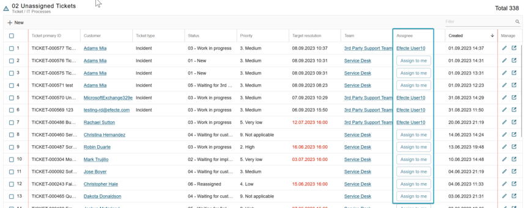

# ESM: Support for TicketReservation button in new list view

**Källa:** https://community.efecte.com/t/h7yqlds/esm-support-for-ticketreservation-button-in-new-list-view
**Publicerad:** 2023-09-01T14:02:59.530Z
**Uppdaterad:** 2023-09-01T16:18:04.460000
**Författare:** 

---

ESM: Support for TicketReservation button in new list view

      
    
          
      

        
              Jonne KaukoProduct Manager
            

            Senior Product Manager & Product Lead, M42 Core & Pro
              Jonne_Kauko
            updated 2 yrs agoFri, September 1, 2023 at 4:18 PM GMT+2
  

           Done
        

        
    
 Problem statement  
 In the early access beta UI of ESM 2023.2, the list view currently offers a restricted range of supported handlers and functionalities. Unfortunately, one functionality that's currently missing is the ability to reserve tickets for support personnel.  
  Short description  
 We are introducing an enhancement to address this issue. The next release is planned to add support for the TicketReservation button within the new list view in the early access beta UI.  
  Use case details  
 The TicketReservation button, which relies on the TicketReservation and CategoryDropdownReference handlers, will now be integrated into the new list view of the early access beta UI. This improvement will facilitate smoother ticket reservation processes and enhance the overall user experience.  
  
   
          
  Vote
  Follow
    
            1

## Bilder

