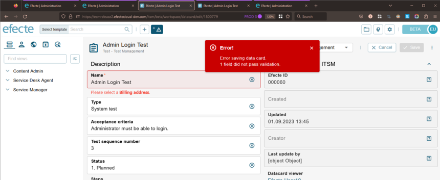

# ESM: Support for ValidatorHandler in new datacard view

**Källa:** https://community.efecte.com/t/60yql54/esm-support-for-validatorhandler-in-new-datacard-view
**Publicerad:** 2023-09-01T13:44:15.080Z
**Uppdaterad:** 2023-09-01T16:14:20.283000
**Författare:** 

---

ESM: Support for ValidatorHandler in new datacard view

      
    
          
      

        
              Jonne KaukoProduct Manager
            

            Senior Product Manager & Product Lead, M42 Core & Pro
              Jonne_Kauko
            updated 2 yrs agoFri, September 1, 2023 at 4:14 PM GMT+2
  

           Done
        

        
    
 Problem statement  
 Within the early access beta UI of ESM 2023.2, the datacard view currently offers a constrained selection of supported handlers and functionalities. One notable omission is the absence of the Validator handler, which is essential for creating datacard validations, including conditional mandatory fields.  
  Short description  
 We are introducing an enhancement to address this issue. We are planning to introduce support for the Validator handler in the new datacard view in the early access beta UI.   
  Use case details  
 The functionality of the Validator handler remains similar to the current UI.   
   
          
  Vote
  Follow

## Bilder

