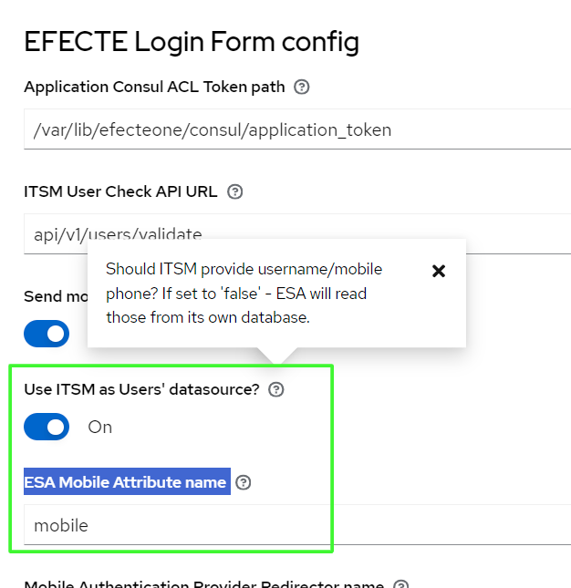

# ESA: Support for read ESM local user's mobile number to ESA claim

**Källa:** https://community.efecte.com/t/g9y3mb4/esa-support-for-read-esm-local-users-mobile-number-to-esa-claim
**Publicerad:** 2023-12-18T08:25:38.527Z
**Uppdaterad:** 2023-12-18T09:25:38.527000
**Författare:** 

---

ESA: Support for read ESM local user's mobile number to ESA claim

      
    
          
      

        
              Tuija Länsisalmi
            

            
              Tuija_Lansisalmi
            2 yrs agoMon, December 18, 2023 at 9:25 AM GMT+1
  

           Done
        

        
    

      
          

    
        
        
        
      

    

  Problem statement 
It is currently not possible to associate a phone number with ESM local users to make the login strong with the One-Time Password option.
Short description
We are introducing an enhancement to address this issue. We plan to introduce support for  the possibility to read mobile phone information from the ESM solution as a claim to the ESA solution. 
Use case details
ESA Admin user can configure easily from UI that ESA is able to add mobile claim to local ESM users based on data from ESM. This is a necessary feature when you want to enhance the security of ESM local users with a one-time SMS password.
 
          
    
        ESA
      
    
  
  Vote
  Follow

## Bilder

