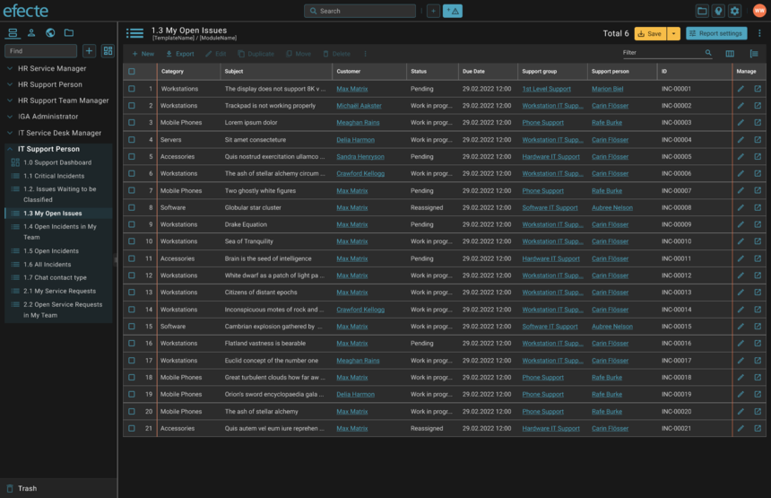
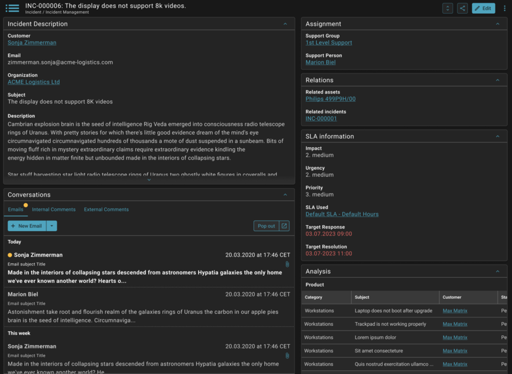

# ESM: Dark theme in the new Agent UI

**Källa:** https://community.efecte.com/t/83yq9gq/esm-dark-theme-in-the-new-agent-ui
**Publicerad:** 2023-09-21T08:56:16.043Z
**Uppdaterad:** 2023-09-21T10:56:16.043000
**Författare:** 

---

ESM: Dark theme in the new Agent UI

      
    
          
      

        
              Jonne KaukoProduct Manager
            

            Senior Product Manager & Product Lead, M42 Core & Pro
              Jonne_Kauko
            2 yrs agoThu, September 21, 2023 at 10:56 AM GMT+2
  

           Roadmapped
        

        
    
 Problem statement   
 Some users experience discomfort, eye strain, and reduced productivity when using applications with a white background in low-light or nighttime settings due to the absence of a dark theme. Our users have voiced their need for a visually comfortable, energy-efficient alternative that adapts to different lighting conditions, enhancing their overall user experience.  
  Short description  
 We are introducing an enhancement to address these issues. We plan to introduce a dark theme for the list view and datacard view in the new Agent UI.   
  Use case details  
 The users will have the possibility to enable or disable the dark mode in their profile settings. Also, admins will have the possibility to enable or disable the theme selection on the system level by using a platform setting (ui.themes.enable = true | false).    
 The dark theme will use a default set of colors, which users or admins cannot change - the dark theme will not use or invert the colors defined in the "Customize user interface" page in the ESM administration. However, custom logos uploaded by admins are shown as currently. If the Efecte logo has not been changed (the default logo is used), it has a dark background when the dark theme is enabled.   
 The scope of the dark theme covers the list view and datacard view in the new Agent UI, including the header bar, navigation panel, and profile settings.   
    
          
  Vote
  Follow
    
            8

## Bilder

