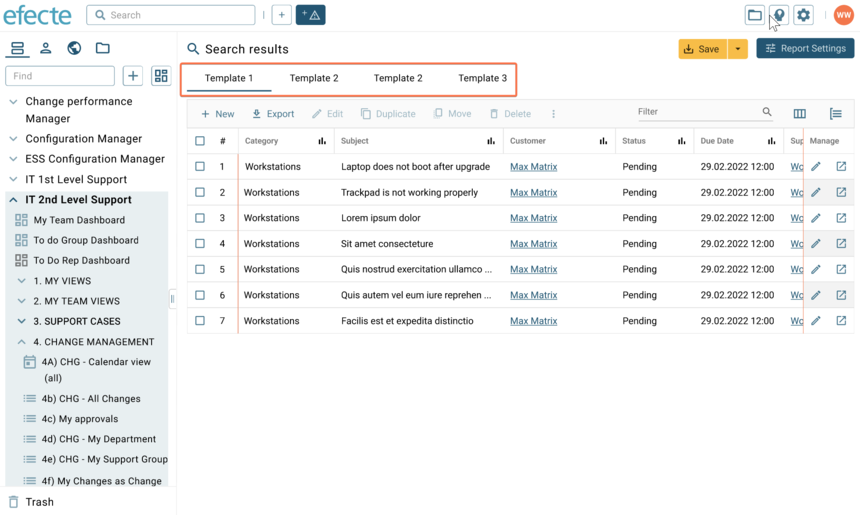

# ESM: Multitemplate list views in the new UI

**Källa:** https://community.efecte.com/t/83yh3jn/esm-multitemplate-list-views-in-the-new-ui
**Publicerad:** 2023-09-26T12:46:38.880Z
**Uppdaterad:** 2023-09-26T15:01:40.677000
**Författare:** 

---

ESM: Multitemplate list views in the new UI

      
    
          
      

        
              Jonne KaukoProduct Manager
            

            Senior Product Manager & Product Lead, M42 Core & Pro
              Jonne_Kauko
            updated 2 yrs agoTue, September 26, 2023 at 3:01 PM GMT+2
  

           Roadmapped
        

        
    
 Problem statement   
 In the early access beta UI (ESM 2023.3), the list view currently offers a restricted range of supported functionalities. Unfortunately, one functionality currently missing is the ability to use multitemplate list views when using the global search or saved multitemplate views.    
  Short description  
 We are introducing an enhancement to address this issue. We plan to introduce support for multitemplate list views within the early access beta UI. This allows users to use the global search for searching across multiple templates.   
  Use case details  
 We're excited to announce a significant enhancement to the way we display multitemplate list views. Currently, multitemplate results are arranged in a linear list view, one after the other, in the user interface. This presentation method often leads to a common user frustration – the most relevant results are frequently buried beyond the initial page. This happens because results are ordered alphabetically by template name, causing the first pages to be cluttered with less pertinent data cards, such as Active Directory Groups and Approval data cards. As a result, users are compelled to either sift through multiple pages or refine their search to a specific template.  
 To address this usability challenge, we're implementing a solution that introduces tabs for presenting both multitemplate search results and multitemplate list views. With this update, templates with associated results will be displayed as tabs, enabling users to select the template they wish to explore effortlessly.  
 Moreover, this change offers significant performance improvements. By displaying results on tabs, the initial search query, which may contain substantial amounts of data, no longer needs to encompass all tab data at once. Instead, data will be loaded on-demand when the user clicks on a tab, avoiding the need to load all data upfront. This optimizes the user experience and ensures a smoother and more efficient navigation of multitemplate list views.  
   
          
  Vote
  Follow
    
            1

## Bilder

