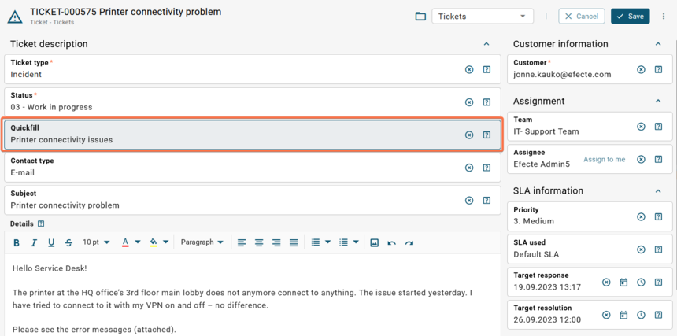

# ESM: Support for Quickfill handler in the new datacard view

**Källa:** https://community.efecte.com/t/m1yq9pp/esm-support-for-quickfill-handler-in-the-new-datacard-view
**Publicerad:** 2023-09-21T08:23:11.953Z
**Uppdaterad:** 2023-09-21T10:23:11.953000
**Författare:** 

---

ESM: Support for Quickfill handler in the new datacard view

      
    
          
      

        
              Jonne KaukoProduct Manager
            

            Senior Product Manager & Product Lead, M42 Core & Pro
              Jonne_Kauko
            2 yrs agoThu, September 21, 2023 at 10:23 AM GMT+2
  

          1reply
        Rickard Berghede8 mths agoFri, May 9, 2025 at 3:20 PM GMT+2
  
         Roadmapped
        

        
    
 Problem statement   
 In the early access beta UI (ESM 2023.3), the datacard view currently offers a restricted range of supported handlers and functionalities. Unfortunately, one functionality currently missing is the ability to use the Quickfill functionality for populating datacard attributes. Also, there is room for improvement related to how Quickfills are currently applied.   
  Short description  
 We are introducing an enhancement to address these issues. We plan to introduce support for the Quickfill handler within the newly implemented datacard view in the early access beta UI while improving the user experience.   
  Use case details  
 The functionality of the Quickfill handler in the new datacard view will closely align with that of the current UI. However, we are improving the user experience by streamlining the functionality by removing an unnecessary step.  
 In the current UI, users must 1) select the Quickfill from the dropdown and 2) click "Select" to apply the Quickfill.  
 In the new Agent UI, users can select the Quickfill, and it will be applied right away without additional clicks.   
  
 Quickfill in the new Agent UI:   
    
 For comparison, here's the Quickfill handler in the current UI:    
   
          
    
        IT Service Management
      
    
  
  Vote
  Follow
    
            1

## Bilder

