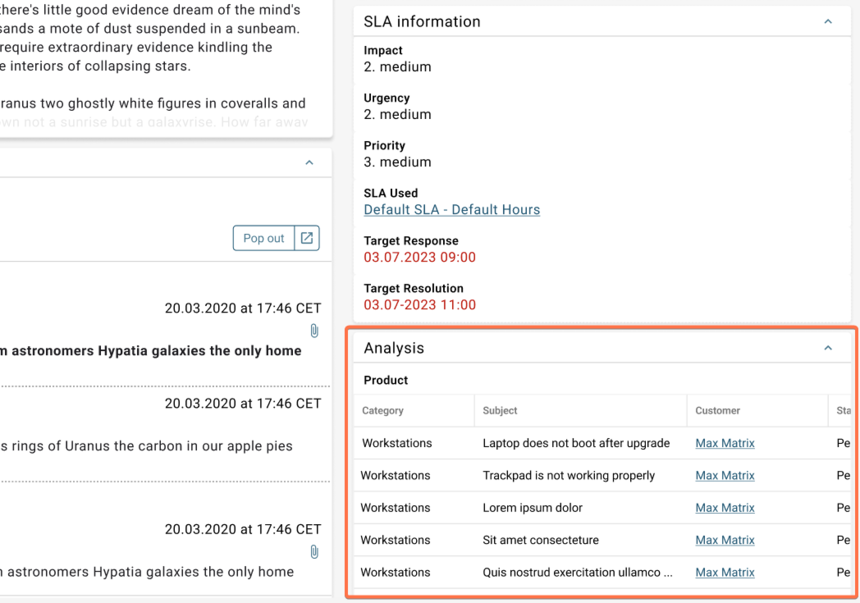

# ESM: Support for reference tables in the Agent UI

**Källa:** https://community.efecte.com/t/m1yq9gm/esm-support-for-reference-tables-in-the-agent-ui
**Publicerad:** 2023-09-21T09:22:52.277Z
**Uppdaterad:** 2023-09-21T11:22:52.277000
**Författare:** 

---

ESM: Support for reference tables in the Agent UI

      
    
          
      

        
              Jonne KaukoProduct Manager
            

            Senior Product Manager & Product Lead, M42 Core & Pro
              Jonne_Kauko
            2 yrs agoThu, September 21, 2023 at 11:22 AM GMT+2
  

           Roadmapped
        

        
    
 Problem statement   
 In the early access beta UI (ESM 2023.3), the datacard view currently offers a restricted range of supported functionalities. Unfortunately, one functionality currently missing is the ability to view references in an embedded reference table in the datacard view.   
  Short description  
 We are introducing an enhancement to address these issues. We plan to introduce support for reference tables within the newly implemented datacard view in the early access beta UI.   
  Use case details  
 On a high level, the functionality of the reference tables in the new datacard view will be similar to the current UI. However, we are introducing several improvements, such as:  
 
   Users can adjust the column width manually    
   Users can scroll both vertically and horizontally    
   The users can sort the results based on columns   
 The table width scales to the class width and utilizes the available space well 
   The admins can select whether the users can remove (unlink) a reference. Currently, there is a cross for unlinking the reference, which cannot be disabled.    
 
   
          
  Vote
  Follow

## Bilder

