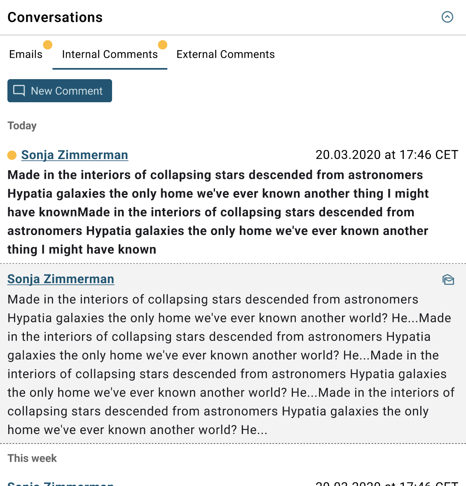

# ESM: Support for Worklog handler in the new Agent UI

**Källa:** https://community.efecte.com/t/p8yq9pa/esm-support-for-worklog-handler-in-the-new-agent-ui
**Publicerad:** 2023-09-21T08:34:52.473Z
**Uppdaterad:** 2023-09-21T10:34:52.473000
**Författare:** 

---

ESM: Support for Worklog handler in the new Agent UI

      
    
          
      

        
              Jonne KaukoProduct Manager
            

            Senior Product Manager & Product Lead, M42 Core & Pro
              Jonne_Kauko
            2 yrs agoThu, September 21, 2023 at 10:34 AM GMT+2
  

           Roadmapped
        

        
    
 Problem statement   
 In the early access beta UI (ESM 2023.3), the datacard view currently offers a restricted range of supported handlers and functionalities. Unfortunately, one functionality that is currently only partially supported is the Worklog handler which is used for adding comments to datacards. Also, there is room for improvement related to the current user experience related to the Worklog handler.    
  Short description  
 We are introducing an enhancement to address these issues. We plan to introduce support for the Worklog handler within the newly implemented datacard view in the early access beta UI while improving the user experience.   
  Use case details  
 The functionality of the Worklog handler in the new datacard view will closely align with that of the current UI. However, we are improving the legibility of the comments and making the UI easier to use while renewing the user interface.   
  
   
          
  Vote
  Follow

## Bilder

