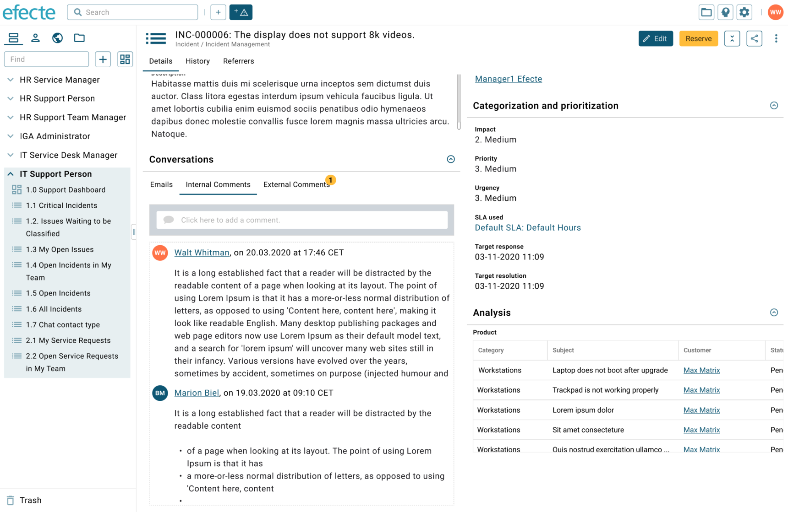
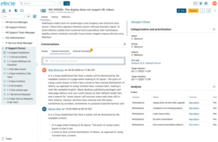
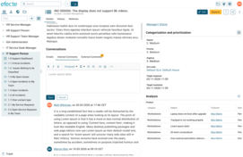

# ESM: Viewing and sending comments (worklog) from the new beta UI datacard view

**Källa:** https://community.efecte.com/t/83h6n2d/esm-viewing-and-sending-comments-worklog-from-the-new-beta-ui-datacard-view
**Publicerad:** 2020-10-15T11:56:00.000Z
**Uppdaterad:** 2024-01-23T07:48:58
**Författare:** 

---

ESM: Viewing and sending comments (worklog) from the new beta UI datacard view

      
    
          
      

        
              Aki Koivukoski
            

            R&D
              Aki_Koivukoski
            updated 1 yr agoTue, January 23, 2024 at 7:48 AM GMT+1
  

          4replies
        Jonne KaukoProduct Manager2 yrs agoTue, February 14, 2023 at 3:46 PM GMT+1
  
         Roadmapped
        

        
    

      
          

    
        
        
        
      

     
          
          

  

  ContentsUser Story:ACs:User Story:
As a Service Management Tool user, I want a modern user interface that displays comments and notes in a modern conversational style to have an efficient way to create and read short texts.
ACs:

 All current worklog capabilities should be supported in the new UI. The design might suggest some capabilities not supported by the worklog handler. These are scoped out from this story. Examples below:
  
   Username as link → not in scope
   User initials as icon → not in scope
  
 If there is at least an attribute with EntityStateMail handler and an attribute with Worklog handler in the same class, the Worklog handler should be presented as a tab.
  
   The tab label should be equal to the attribute name. The name should be translatable.
  
 If there is at least more than one Worklog handler in the same class, the Worklog handler should be presented as a tab.  
  
   The tab label should be equal to the attribute name. The name should be translatable.  
  
 If there is one Worklog handler but no other Worklogs or EntityStatemails in the same class, the Worklog handler should be presented as any other attribute (not on tab
 The user should be able to add comments in both plain text and rich text formats, as currently.
  
   The new rich text editor should be used in the worklog handler. 
    
     Also colored text should be supported 
    
  
 Pressing the enter key on the keyboard should add a new line
 The user should be able to make comments unread (star in the current worklog)
  
   Highlighted comments (by any user) shall be highlighted for all users
   Highlighted comments should be shown in the list view with icons
  
 The current metadata options ("Hide existing logs in edit mode", "Ignore data card lock") should work with the new UI
 "Swarming" should be supported: added comments should be directly visible for other users viewing the datacard
 ESS should be able to insert comments to the worklog handler, as currently
 There should be a max height for the component
 The compact mode should retain the same size in terms of height, but should decrease the font size and line height to make more content fit into the area.

          
    
        Service Management Tool
      
    
  
  Vote
  Follow
    
            7

## Bilder

