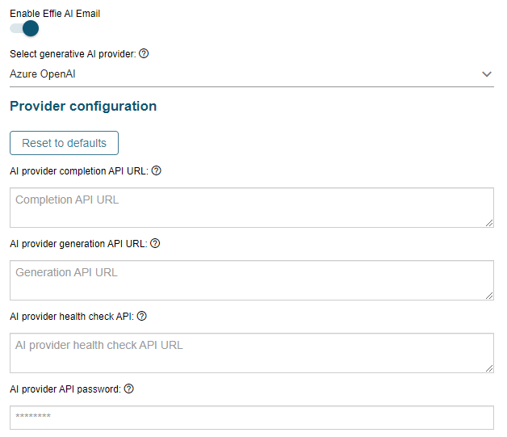

# Azure OpenAI support for Effie AI Email

**Källa:** https://community.efecte.com/t/y4yx2y3/azure-openai-support-for-effie-ai-email
**Publicerad:** 2024-02-13T14:06:33.573Z
**Uppdaterad:** 2024-02-13T15:06:33.573000
**Författare:** 

---

Azure OpenAI support for Effie AI Email

      
    
          
      

        
              Juha HänninenProduct Owner
            

            ESM Product Owner
              Juha_Hanninen.1
            1 yr agoTue, February 13, 2024 at 3:06 PM GMT+1
  

          

        
    
Problem statement 
Organizations are making investments to research opportunities in utilizing generative AI in business context. Azure OpenAI service is a popular option for using Generative AI, and organizations expect to be able to utilize that in business applications to enhance their efficiency.
 
Short description
It will be possible to leverage existing Azure OpenAI investment with Effie AI Email, by connecting Effie AI Email to an Azure OpenAI tenant.
 
Use case details
Administrator can select Azure OpenAI as a GenAI service provider option in Effie AI Email settings, and connect to their own Azure tenant to power Effie AI Email.
ESM support agents can use the Effie AI Email features powered by the customer's Azure tenant and AI services running there.

          
    
        Effie AI
      
    
  
  Vote
  Follow

## Bilder

