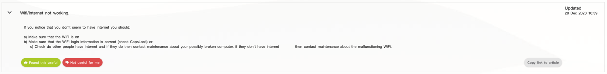

# ESS: Copy link to Tips&Tricks article

**Källa:** https://community.efecte.com/t/35y8hgd/ess-copy-link-to-tipstricks-article
**Publicerad:** 2024-02-29T12:09:20.627Z
**Uppdaterad:** 2024-02-29T13:09:20.627000
**Författare:** 

---

ESS: Copy link to Tips&Tricks article

      
    
          
      

        
              Aki YlivarviModerator
            

            
              Aki_Ylivarvi
            1 yr agoThu, February 29, 2024 at 1:09 PM GMT+1
  

           Done
        

        
    
Problem statement
There is no convenient way to send a link to the Tips&Tricks article that agents could share with end users. 
Short description
ESS should have a “Copy link to article” quick action button on each Tips&Tricks article.
Use case details
As an ESS user, I can quickly copy links to any article that I can see. 
AC:

 Clicking on the “Copy link to the article” shall copy the link to that Tips&Tricks article to the clipboard.
 Clicking on the shared link, the end user should get redirected to the article even if they need to authenticate to ESS

          
    
        Self-Service Portal
      
    
  
  Vote
  Follow

## Bilder

