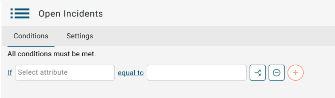
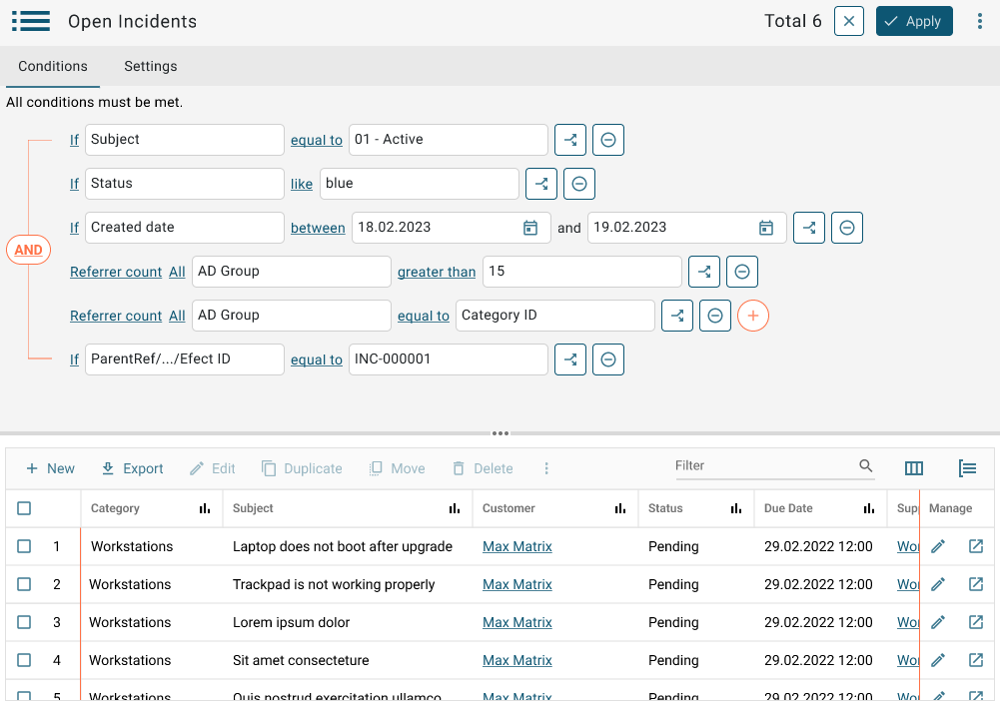

# Editing view conditions in the new agent UI

**Källa:** https://community.efecte.com/t/x2y8rts/editing-view-conditions-in-the-new-agent-ui
**Publicerad:** 2024-03-20T06:59:32.127Z
**Uppdaterad:** 2024-03-20T07:59:32.127000
**Författare:** 

---

Editing view conditions in the new agent UI

      
    
          
      

        
              Juha HänninenProduct Owner
            

            ESM Product Owner
              Juha_Hanninen.1
            1 yr agoWed, March 20, 2024 at 7:59 AM GMT+1
  

           In Progress
        

        
    
Problem statement 
The new UI supports list views, but not view conditions for filtering the data shown in the list views. Searching for information in is difficult without being able to filter data based on attribute values, and it is cumbersome to only use views created in the old UI for finding lists of information.
 
Short description
Condition editing capabilities that allows users to filter relevant information to the views.
 
 
Use case details
The agent is able to filter out information based on different conditions and save new views. It should be possible to view existing views. All data types are supported.
 
 
Creating new conditions:

Viewing and editing conditions:

 
          
  Vote
  Follow
    
            1

## Bilder

