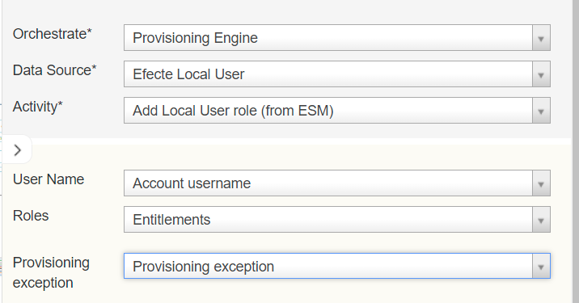

# EPE:  Capability to update local user's roles

**Källa:** https://community.efecte.com/t/y4y6f4t/epe-capability-to-update-local-users-roles
**Publicerad:** 2024-04-18T06:23:53.520Z
**Uppdaterad:** 2024-09-10T07:30:45.607000
**Författare:** 

---

EPE:  Capability to update local user's roles

      
    
          
      

        
              Tuija Länsisalmi
            

            
              Tuija_Lansisalmi
            updated 1 yr agoTue, September 10, 2024 at 7:30 AM GMT+2
  

           Done
        

        
    

      
          

    
        
        
        
      

    

  Problem statement 
Currently a new local user can be created with Efecte roles, but those cannot be updated. For example if user’s title or responsibilities are changed roles must be updated too.  In this release EPE will have functionality for updating ESM roles for Efecte local users. This feature allows Efecte Admin to manage the lifecycle of local users. 
 
Short description
EPE connector new workflow activity: Add Local User role (from ESM).
 
Use case details
The EPE Administrators  can configure Orchestration node for Local Efecte User provisioning for updating existing roles. 
          
    
        EPE
      
    
  
  Vote
  Follow

## Bilder

