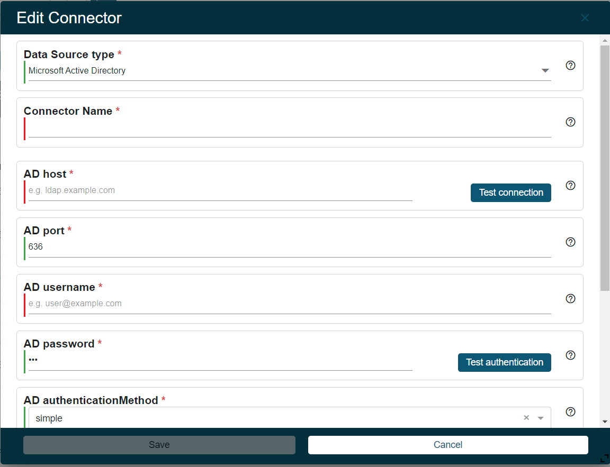

# EPE connector page renewal: Connection settings improvement

**Källa:** https://community.efecte.com/t/y4y3m24/epe-connector-page-renewal-connection-settings-improvement
**Publicerad:** 2023-12-18T07:14:43.620Z
**Uppdaterad:** 2023-12-18T08:16:28.390000
**Författare:** 

---

EPE connector page renewal: Connection settings improvement

      
    
          
      

        
              Tuija Länsisalmi
            

            
              Tuija_Lansisalmi
            updated 2 yrs agoMon, December 18, 2023 at 8:16 AM GMT+1
  

           Done
        

        
    

      
          

    
        
        
        
      

    

  Problem statement 
Each connector task requires the connection settings to be configured separately, even if the source directory is the same. This causes a lot of maintenance if, for example, the target system password is changed. Especially in IGA solutions there are several connector tasks to the same directory.
 
Short description
We are introducing an enhancement to address this issue. Connector page renewal includes an enhancement that the connection settings needs to be defined only once per connector.
 
Use case details
Connector page renewal includes improvement that the connection settings needs to be defined only once per connector (directory). Previously, these had to be defined for each task separately.
          
    
        EPE
      
    
  
  Vote
  Follow

## Bilder

