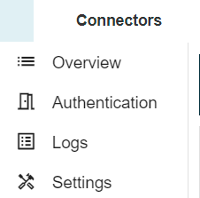

# EPE connector page renewal: Connector management divided into tabs

**Källa:** https://community.efecte.com/t/g9y3m27/epe-connector-page-renewal-connector-management-divided-into-tabs
**Publicerad:** 2023-12-18T06:58:46.500Z
**Uppdaterad:** 2023-12-18T08:04:58.637000
**Författare:** 

---

EPE connector page renewal: Connector management divided into tabs

      
    
          
      

        
              Tuija Länsisalmi
            

            
              Tuija_Lansisalmi
            updated 2 yrs agoMon, December 18, 2023 at 8:04 AM GMT+1
  

           Done
        

        
    

      
          

    
        
        
        
      

    

  Problem statement 
Efecte provisioning engine contains lot of settings, which can sometimes be difficult to find. Especially as the main admin users do not use this section on a daily basis
 
Short description
We are introducing four new tabs for connector management. Using tabs for connectors managements will provide advantages such as saving space and increasing accessibility. 
 
Use case details
Connector management will be divided into four tabs: Overview, Authentication, Logs and Settings.
          
    
        EPE
      
    
  
  Vote
  Follow

## Bilder

