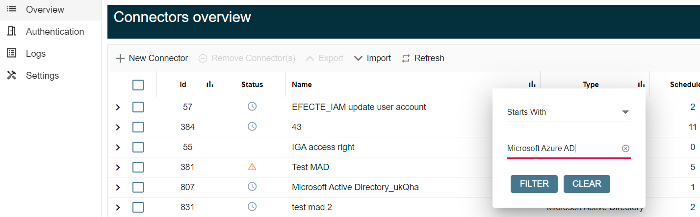

# EPE connector page renewal: Connector view can be sorted and filtered

**Källa:** https://community.efecte.com/t/y4y3mb6/epe-connector-page-renewal-connector-view-can-be-sorted-and-filtered
**Publicerad:** 2023-12-18T07:22:53.410Z
**Uppdaterad:** 2023-12-18T08:37:23.407000
**Författare:** 

---

EPE connector page renewal: Connector view can be sorted and filtered

      
    
          
      

        
              Tuija Länsisalmi
            

            
              Tuija_Lansisalmi
            updated 2 yrs agoMon, December 18, 2023 at 8:37 AM GMT+1
  

           Done
        

        
    

      
          

    
        
        
        
      

    

   
Problem statement 
If there are several connectors in the environment it is difficult to find them as they cannot be sorted or filtered in any way. 
 
Short description
We are introducing an enhancement to address this issue. Connector page renewal includes an enhancement that the connector views can be sorted and filtered.
 
Use case details
User can filter results easily from the Connector UI and sort the results. Previously this was not possible for the connectors. This feature makes it easier to manage connectors.
 
          
    
        EPE
      
    
  
  Vote
  Follow

## Bilder

