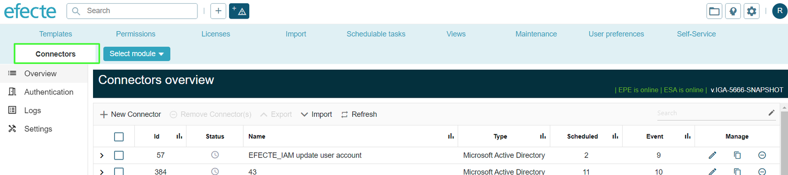

# EPE connector page renewal: Connectors tab

**Källa:** https://community.efecte.com/t/83y3m22/epe-connector-page-renewal-connectors-tab
**Publicerad:** 2023-12-18T06:50:35.023Z
**Uppdaterad:** 2023-12-18T07:55:37.030000
**Författare:** 

---

EPE connector page renewal: Connectors tab

      
    
          
      

        
              Tuija Länsisalmi
            

            
              Tuija_Lansisalmi
            updated 2 yrs agoMon, December 18, 2023 at 7:55 AM GMT+1
  

           Done
        

        
    

      
          

    
        
        
        
      

    

   
Problem statement 
Efecte provisioning engine tab is now named IGA. This is misleading because some of the connectors are also available in ITSM solutions. 
 
Short description
We are introducing new Connectors tab that is replacing the IGA tab to address this issues.
 
Use case details
Efecte Provisioning Engine tab will be renamed from IGA to Connectors. This change will clarify that the connectors are not only for the IGA solution but some are also available for ITSM customers.
          
    
        EPE
      
    
  
  Vote
  Follow

## Bilder

