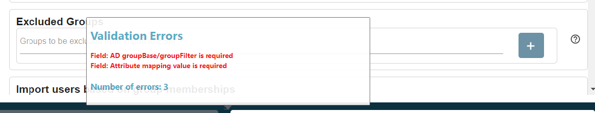

# EPE connector page renewal: Error message improvement

**Källa:** https://community.efecte.com/t/x2y3mbw/epe-connector-page-renewal-error-message-improvement
**Publicerad:** 2023-12-18T08:07:42.463Z
**Uppdaterad:** 2023-12-18T09:07:42.463000
**Författare:** 

---

EPE connector page renewal: Error message improvement

      
    
          
      

        
              Tuija Länsisalmi
            

            
              Tuija_Lansisalmi
            2 yrs agoMon, December 18, 2023 at 9:07 AM GMT+1
  

           Done
        

        
    

      
          

    
        
        
        
      

    

  Problem statement 
In some cases it is not clear what is causing the failure when you are creating a new connector or updating an existing one.
 
Short description
We are introducing an enhancement to address this issue. Connector page renewal includes an enhancement that the new interface gives the Admin user clearer error messages. 
 
Use case details
User can easily see from the Connector UI what is causing the error. It is easier for the user to correct errors and the interface guides the user to make the right decisions. 
          
    
        EPE
      
    
  
  Vote
  Follow

## Bilder

