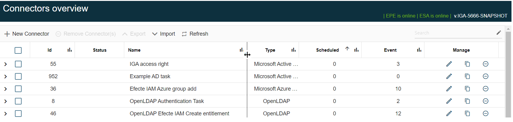

# EPE connector page renewal: Resize the column width

**Källa:** https://community.efecte.com/t/p8y3mbl/epe-connector-page-renewal-resize-the-column-width
**Publicerad:** 2023-12-18T08:02:23.070Z
**Uppdaterad:** 2023-12-18T09:02:23.070000
**Författare:** 

---

EPE connector page renewal: Resize the column width

      
    
          
      

        
              Tuija Länsisalmi
            

            
              Tuija_Lansisalmi
            2 yrs agoMon, December 18, 2023 at 9:02 AM GMT+1
  

           Done
        

        
    

      
          

    
        
        
        
      

    

  Problem statement 
Columns in connector view are sometimes too narrow to show the full length of the column values or are consuming too much space.
 
Short description
We are introducing an enhancement to address this issue. Connector page renewal includes an enhancement that the connector columns can be resized.
 
Use case details
User can adjust columns easily from the Connector UI. Previously this was not possible to do. This feature makes it easier to manage connectors.
 
          
    
        EPE
      
    
  
  Vote
  Follow

## Bilder

