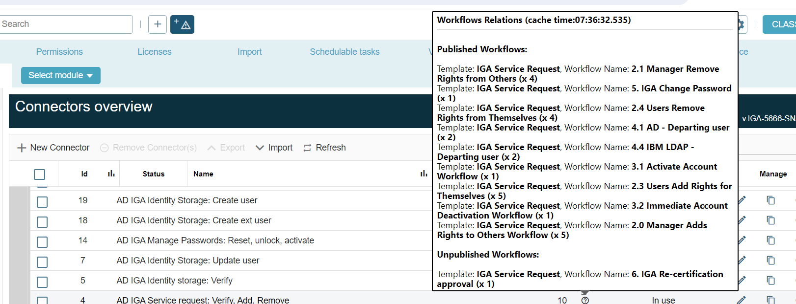

# EPE connector page renewal: Workflow relations view

**Källa:** https://community.efecte.com/t/p8y68qh/epe-connector-page-renewal-workflow-relations-view
**Publicerad:** 2024-04-10T04:51:32.187Z
**Uppdaterad:** 2024-04-10T06:51:32.187000
**Författare:** 

---

EPE connector page renewal: Workflow relations view

      
    
          
      

        
              Tuija Länsisalmi
            

            
              Tuija_Lansisalmi
            1 yr agoWed, April 10, 2024 at 6:51 AM GMT+2
  

           Done
        

        
    

      
          

    
        
        
        
      

    

  Problem statement 
The Connector administrator cannot see from the user interface which workflows the task refers to, but has to check this from the individual workflows. This is time consuming and can lead to errors
 
Short description
We are introducing an enhancement to address this issue. Connector page renewal includes an enhancement that Connector admin can choose Show workflow references view that will display where task is in use and is the workflow published or not. 
 
Use case details
Connector Admin can easily see from the Connector UI can he do changes to the task and how it will affect to workflows.  It is easier for the user to spot risks and errors when the interface guides the user to make the right decisions. 
          
    
        EPE
      
    
        Workflow
      
    
  
  Vote
  Follow

## Bilder

