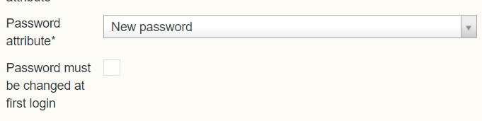

# EPE&ESA: Efecte local user to support first time passwords

**Källa:** https://community.efecte.com/t/g9y6309/epeesa-efecte-local-user-to-support-first-time-passwords
**Publicerad:** 2024-04-09T04:51:54.617Z
**Uppdaterad:** 2024-04-09T06:51:54.617000
**Författare:** 

---

EPE&ESA: Efecte local user to support first time passwords

      
    
          
      

        
              Tuija Länsisalmi
            

            
              Tuija_Lansisalmi
            1 yr agoTue, April 9, 2024 at 6:51 AM GMT+2
  

           Done
        

        
    
Problem statement 
Currently when a new local user is created on EPE the password admin enters the password or it is autogenerated with workflow. Usually initial password is delivered to the end-user without any enforcement to change the password on first login. The problem is that the user cannot easily create a strong password for themselves. 
 
Short description
EPE connector capabilities that allows Efecte's local users to change their password at first login. 
 
Use case details
The EPE admin is able to set “Password must be changed at first login” setting in workflow. 

ESA displays after first successful login password change screen where Efecte local user must define new password

          
    
        EPE
      
    
        ESA
      
    
  
  Vote
  Follow

## Bilder

