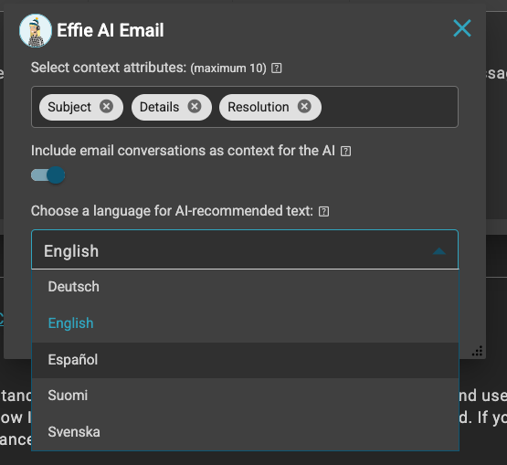

# ESM / Effie AI Email: Multi-language support with Efecte GenAI

**Källa:** https://community.efecte.com/t/p8ymqxs/esm-effie-ai-email-multi-language-support-with-efecte-genai
**Publicerad:** 2024-05-16T12:08:51.560Z
**Uppdaterad:** 2024-05-16T14:08:51.560000
**Författare:** 

---

ESM / Effie AI Email: Multi-language support with Efecte GenAI

      
    
          
      

        
              Juha HänninenProduct Owner
            

            ESM Product Owner
              Juha_Hanninen.1
            1 yr agoThu, May 16, 2024 at 2:08 PM GMT+2
  

          

        
    
Problem statement 
Efecte GenAI is Efecte's own Large Language Model, fine-tuned for ITSM use. It can be used to power Effie AI's Generative AI features. For Effie AI Email, it is not currently possible to generate content in other languages than English when Efecte GenAI is in use.
 
Short description
Effie AI Email with Efecte GenAI supports now English, Finnish, Swedish, German, Polish, Spanish
 
Use case details
Users of Effie AI Email can now choose in which supported language is the email being generated, with any feature (Generate, Correct, Complete)
 

 
          
    
        Effie AI
      
    
        Service Management Tool
      
    
  
  Vote
  Follow

## Bilder

