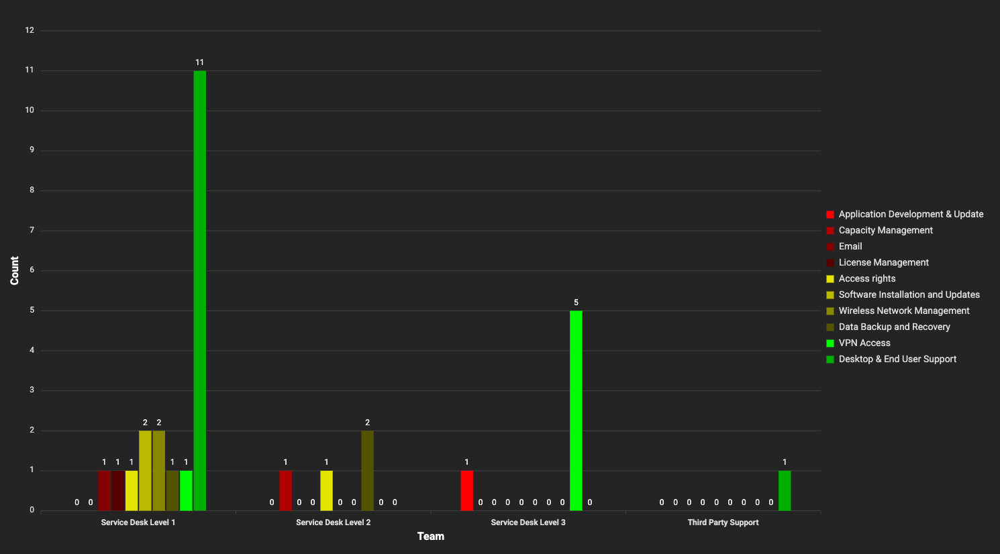

# New Agent UI: View-only mode for graphs

**Källa:** https://community.efecte.com/t/y4yms4q/new-agent-ui-view-only-mode-for-graphs
**Publicerad:** 2024-07-02T13:34:30.963Z
**Uppdaterad:** 2024-07-04T14:27:20.530000
**Författare:** 

---

New Agent UI: View-only mode for graphs

      
    
          
      

        
              Juha HänninenProduct Owner
            

            ESM Product Owner
              Juha_Hanninen.1
            updated 1 yr agoThu, July 4, 2024 at 2:27 PM GMT+2
  

          

        
    

  
    New Agent UI graphs demo 2024.2
  
  
  ContentsProblem statementShort descriptionUse case details
Problem statement
Reporting capabilities are not yet supported in the new Agent UI.
 
Short description
Basic graphical views are now supported in view-only mode in the new Agent UI, allowing support agents and managers to use the new Agent UI for reporting.
 
Use case details
The following graph types are supported in view-only mode in the New Agent UI:

 Bar chart
 Line chart
 Pie chart
 Stacked bar chart
 Clustered bar chart
 Relative bar chart
 Speedometer
 Status light

 
Views must be created and saved in the Classic UI to be used in the new Agent UI.

 Existing user permissions are used to access the views
 The existing settings are used
 There is no pagination - all data that is available using the conditions of the view is displayed by default 
  
   You can select a certain area for more detailed observation by selecting the area with a mouse (with all bar charts and line charts)
  
 Role, personal, and global views are supported
 Drill-down to data sub-sets is possible by clicking any data set, such as a bar or data point on a line chart
 Dynamic filtering of data is supported when the Legend option is turned on 
  
   You can dynamically change which data sets are included. For example, with a single click, you could remove a certain support team from the graphical report
   Changes are not persisted, as editing of the views is not supported yet
  

Quick demo of some graphs in the new Agent UI:
New Agent UI graphs demo 2024.2
          
    
        Service Management Tool
      
    
  
  Vote
  Follow
    
            1

## Bilder

