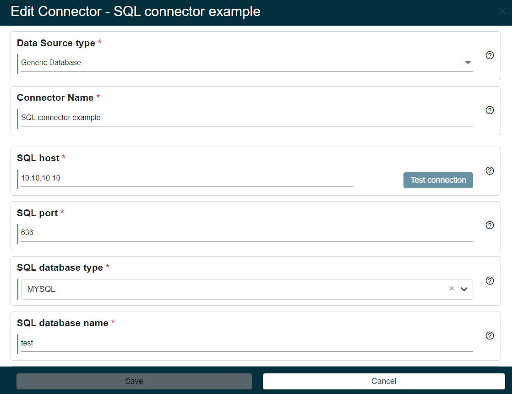

# New EPE Connector: Generic SQL

**Källa:** https://community.efecte.com/t/35y8nn0/new-epe-connector-generic-sql
**Publicerad:** 2024-03-26T10:06:35.990Z
**Uppdaterad:** 2024-09-10T07:18:16.530000
**Författare:** 

---

New EPE Connector: Generic SQL

      
    
          
      

        
              Tuija Länsisalmi
            

            
              Tuija_Lansisalmi
            updated 1 yr agoTue, September 10, 2024 at 7:18 AM GMT+2
  

           Done
        

        
    

      
          

    
        
        
        
      

    

  ContentsUser story:Background information:What?How?Why?To whom?User story:
As an admin of Efecte Provisioning Engine tool (EPE), I want to able to do provisioning to SQL.
Background information:
What?

 New Generic Database connector to EPE
 Supported databases: Microsoft SQL Server, MySQL, MariaDB and PostgreSQL

How?

 Administrators are able configure connection to SQL using the EPE admin UI 
  
   Processes can be scheduled in ESM Provisioning Tasks UI
   Processes can be run manually from ESM Provisioning UI
  

Why?

 EPE connector catalog must be comprehensive for customers
 Generic Database support has been requested by several customers

To whom?

 EPE Administrators
 EPE Customers

          
    
        EPE
      
    
  
  Vote
  Follow
    
            1

## Bilder

