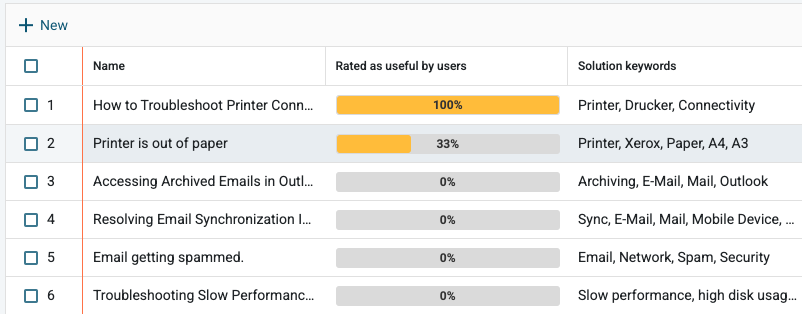
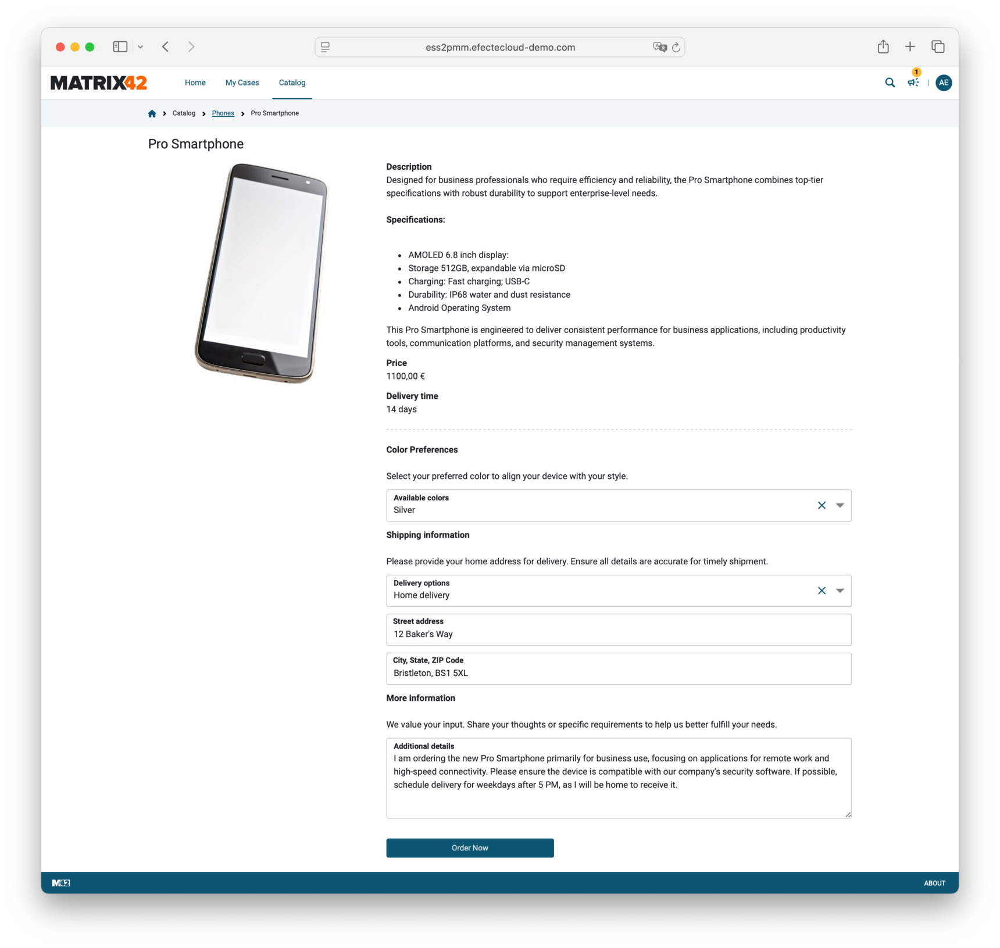

# M42 Core & Pro 2025.2

**Källa:** https://community.efecte.com/t/m1yfn4t/m42-core-pro-20252
**Publicerad:** 2025-04-22T07:28:00.000Z
**Uppdaterad:** 2025-04-22T12:07:13.773000
**Författare:** 

---

M42 Core & Pro 2025.2

      
    
          
      

        
              Araceli del Rio SastreEfecte Employee
            

            Product Marketing Director
              Araceli_del_Rio_Sastre
            updated 8 mths agoTue, April 22, 2025 at 12:07 PM GMT+2
  

          

        
    
ContentsWhat's new in Matrix42 Core and Professional 2025.2?Enhanced Service Management capabilitiesMatrix42 Intelligence - Knowledge discovery for end-usersMicrosoft Teams integration – More than Knowledge discoveryMatrix42 Intelligence - Paving the way for Autonomous AI AgentsAgent UI renewalPassword resetSelf-Service capabilitiesForms for product itemsAccess groups for product catalogList of other important improvementsNative connectorsGeneric REST API connectorGoogle connector with Generic REST APIMicrosoft Graph API connector (formerly Entra ID connector)Microsoft Teams integration via Microsoft Graph API connectorMicrosoft Intune integration via Microsoft Graph API connectorGeneric Python Script connectorWhat's new in Identity Governance & Administration (IGA)
We are pleased to announce the release of Matrix42 Core & Professional 2025.2, an update designed to deliver new and enhanced functionalities for improved service management and identity governance. With this release, our goal is to strengthen your operational efficiency, streamline processes, and ensure a more seamless user experience.
For detailed information about all the features, improvements, and bug fixes in the 2025.2 release, please refer to Docs. If you encounter any issues accessing the link or have questions about upgrading, feel free to contact our service desk at servicedesk@matrix42.com.
Matrix42 Core and Professional reflect the evolution of our former Efecte IT Service Management (ITSM) and Enterprise Service Management solutions, with Matrix42 Core representing Efecte ITSM Essentials and Matrix42 Professional referring to the more advanced and comprehensive Efecte ITSM and Enterprise Service Management solutions.
This update includes also Matrix42 Identity Governance & Administration (IGA), which can be sold together with Matrix42 Core and Professional, or standalone.
What's new in Matrix42 Core and Professional 2025.2?
This release introduces several new innovations and notable enhancements to empower organizations at every stage of their service management and digital transformation journeys, including AI innovations, improvements in Agent UI, Self-Service and password management, and new native connectors.
Enhanced Service Management capabilities
The 2025.2 release marks a major milestone, introducing conversational Knowledge discovery with Microsoft Teams integration, the initial advancements towards Autonomous AI Agents, and multiple enhancements to the Agent UI and password management. These innovations are designed to streamline the knowledge management process, boost productivity and elevate the service management experience for our customers.
We have also rebranded Effie AI to Matrix42 Intelligence for greater clarity and alignment with our vision.
Matrix42 Intelligence - Knowledge discovery for end-users
We’re excited to introduce Knowledge discovery for end-users. Finding the right information within an organization’s resources can be a challenge, especially when quick assistance is needed. For users working in Microsoft Teams, seamless access to support directly within Teams is a must.
Our conversational Knowledge discovery solution tackles these challenges head-on. It enables users to find answers independently by offering seamless access to internal knowledge through self-service portals, Microsoft Teams, and company websites.
Leveraging RAG technology and Generative AI, it integrates seamlessly with data sources like SharePoint, Confluence, KBAs, and websites. This ensures end-users can quickly and efficiently find the support they need, enhancing both ease of access and productivity.
Together with Knowledge discovery, the existing out-of-the-box Knowledge creation use case in AI Actions elevates the knowledge management process to the next level. This capability allows agents to seamlessly create a knowledge article with just one click after resolving a ticket, ensuring the knowledge base is continuously enriched with high-quality content. 
The Knowledge discovery and Knowledge creation capabilities streamline and elevate the knowledge management process, delivering a significant impact on quality and end-user experience.
Microsoft Teams integration – More than Knowledge discovery
Beyond AI-powered Knowledge discovery, the Microsoft Teams integration offers a comprehensive integration to streamline daily support and service operations. Users can submit support tickets, receive real-time ticket updates, and receive personalized notifications—all within Teams.
Whether you’re an end-user seeking help, an agent managing incidents, or a member of a support group, the Teams integration keeps you connected and informed. Admins can customize notification logic in a flexible manner, defining exactly who receives updates and under what conditions.
This tight integration ensures that service management processes are embedded directly into users’ daily workflows, improving responsiveness and collaboration while minimizing tool-switching.
Matrix42 Intelligence - Paving the way for Autonomous AI Agents
We’re also releasing the first advancements towards autonomous AI Agents. This innovation allows customers to further lower their cost per contact by automating routine and repetitive tasks traditionally handled by agents.
Customers can try out our BETA AI workflow node. The new capability can trigger generative AI actions automatically. This allows e.g. translating content automatically, generating drafts for customer communications, automating internal communications, providing lifecycle update reports, or any action imaginable.
The ultimate goal is to create autonomous AI agents capable of making independent decisions and taking actions. Our BETA AI workflow node is the first advancement in this direction, as it adds more capabilities to the toolkit that will evolve into Autonomous AI Agents later.
Agent UI renewal
The 2025.2 release of the Service Management Tool is a significant milestone, establishing the position of our new Agent UI as ready for mainstream use.  Improvement highlights include:

 An improved list view, where we are now releasing capabilities from drag & drop column management to graph creation with a single click.
 And several smaller improvements & bugs to increase agent efficiency in list views, which is one of the most used areas of the application.

Password reset
With 2025.2 release we also introduce updates to password management through Identity Governance & Administration capabilities integrated to Service Management. The enhancements include the following:

 End-users can now securely reset their passwords anytime via the Self-Service portal, eliminating the need to contact the service desk or wait for support hours.
 IT agents benefit from a streamlined process to reset passwords directly within the ticketing system, with secure provisioning across Active Directory, Entra ID, and OpenLDAP.

The enhancements reduce IT workloads and improve user autonomy. This approach saves time, reduces ticket volume, and drives significant cost efficiency across organizations.
This capability is shipped within the latest baseline release. For existing customers, it can be enabled through configuration changes. 
Self-Service capabilities
The Self-Service 2 (ESS2) 2025.2 release introduces new features that enhance usability, including forms for product items; access groups for product catalog and several others.
Forms for product items
We are pleased to announce a new feature that significantly improves the purchasing process: Forms for product items. Previously, our catalog provided fundamental information such as product name, description, and price. With the new functionality, administrators can now enrich product entries with tailored form fields, like dropdown menus for color selection, directly associated with each item.
This enhancement allows users to efficiently navigate choices, selecting options with precision to align perfectly with their needs. By consolidating options within customizable forms, we simplify the catalog.
Administrators have the flexibility to configure these forms to adapt to diverse product offerings, whether deploying a single form across multiple items or creating unique forms for individual listings. These advanced forms elevate the user experience, enhance service capabilities, and provide greater value through improved catalog interaction.

Access groups for product catalog
With Release 2025.2, we are expanding our role-based content capabilities to encompass the product catalog, further refining the personalization of the self-service user interface. The new Access groups for product catalog ensures that content presented to the end user is restricted according to their specific business role, resulting in an even more customized user experience.
Coupled with our previously introduced forms capability, this update significantly extends the potential use cases for self-service interactions by providing more targeted access to products and services. By assigning catalog access based on user roles, you can offer more distinct experiences tailored to each user's needs and responsibilities. Administrators will continue with the user-friendly approach to managing access groups now extended to the catalog.
List of other important improvements

 Unseen announcements: We have improved the announcement feature so users can easily see only the new messages. This helps users stay updated without sifting through old announcements.
 Field validation: This feature checks the information users enter to the short text fields using regular expressions (RegEx), a popular method for ensuring inputs follow specific patterns. This helps make sure all entries are correct and consistent.
 Configurable greeting text: Administrators now have the ability to modify or remove the welcome message that appears on the home page allowing more personalized or simplified user greetings
 Multiple category assignment for products: Product items can now be placed into several categories at once, making it easier to organize and find items in the product catalog.
 Extended links on home page: The number of links you can have on the home page has increased from 5 to 15. This gives more options to add quick links, especially useful when using role-based content.

Native connectors
The 2025.2 release introduces a suite of new and enhanced connectors that improve service management by enabling streamlined automation, seamless integration, and real-time data management across various platforms, including Google Directory, Microsoft Azure, Teams, Intune, and more:

 Generic REST API connector
 Google connector
 Microsoft Graph API connector
 Microsoft Teams integration
 Microsoft Intune integration
 Generic Python script connector

You can find a description for each native connector in Docs, including instructions about how to use the connector, where to use it and related restrictions. 
Generic REST API connector
The new Generic REST API connector streamlines event-based tasks within workflows, providing secure and adaptable automation but currently lacks support for scheduled data imports to M42 Core, Pro, and IGA.
Google connector with Generic REST API
The Google connector, enhanced by Generic REST API integration, allows efficient user and group provisioning to Google Directory through event-based workflows, while future capabilities for scheduled data imports are in development.
Microsoft Graph API connector (formerly Entra ID connector)
Renamed for its enhanced functionalities, the Microsoft Graph API connector facilitates robust integrations with Microsoft services like Azure, Entra ID, Intune, and Teams, supporting both scheduled and event-based operations.
Microsoft Teams integration via Microsoft Graph API connector
This connector now supports Microsoft Teams integration with both scheduled data imports and event-based calls, enhancing collaboration tools and optimizing IT operations.
Note: In these release highlights, we refer to two distinct Teams integrations. The first is a user-focused integration that enables ticket submission, notification management, and AI-powered knowledge discovery. This one here is a provisioning engine-based integration, leveraging the Microsoft Graph API connector to streamline functionality.
Microsoft Intune integration via Microsoft Graph API connector
Microsoft Intune integration capabilities through this connector enhance automation and visibility, supporting scheduled and event-based operations, though Intune reports API is not supported.
Generic Python Script connector
Previously known as Custom Backend connector, the Generic Python Script connector now supports scheduled and event-based provisioning, boosting automation and real-time data management.
What's new in Identity Governance & Administration (IGA)
The 2025.2 release introduces a new AI capability in IGA: Matrix42 Intelligence Communications assistance. 
IGA administrators often face challenges in communicating effectively with end-users who speak different languages, particularly during tasks like access rights reviews. The IGA Communications assistance capability helps admins craft clearer, more polished messages for end-users, such as email notifications. It comes with pre-built use cases designed specifically for service desk communication and can be easily configured to align with your company’s preferred language and tone.
          
    
        Featured
      
    
  
  Like
  Follow

## Bilder

