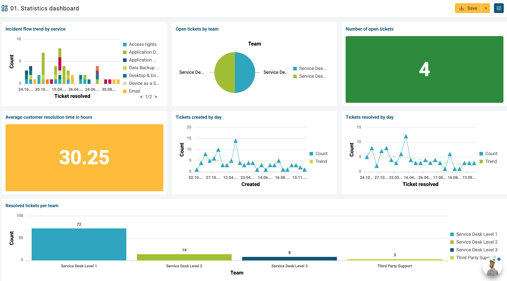
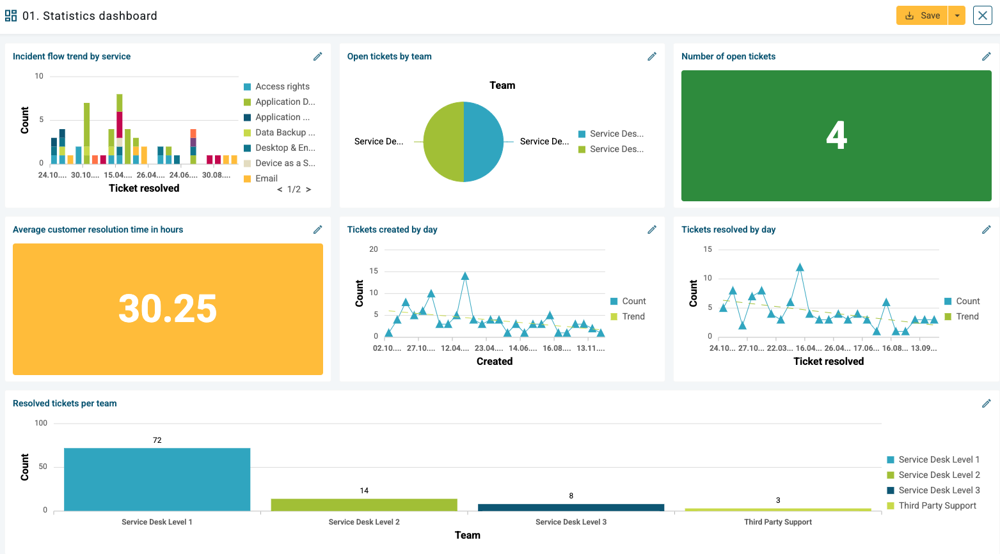
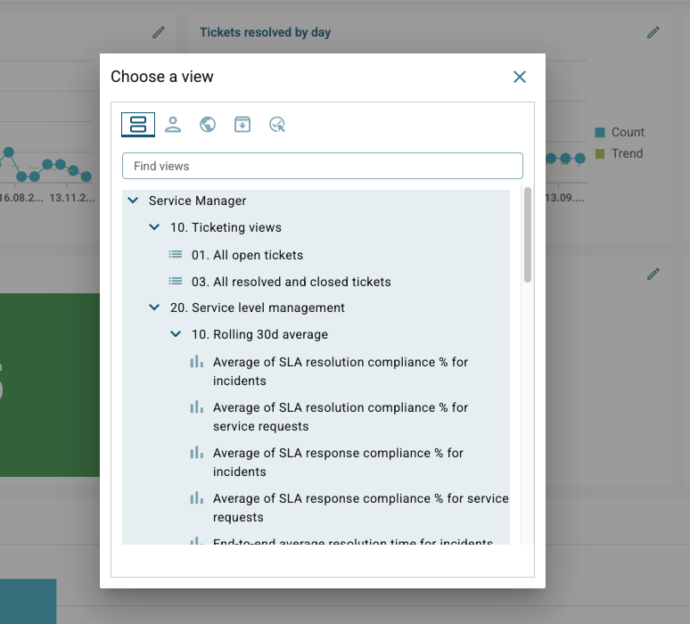

# New Agent UI: Changing views in Dashboards

**Källa:** https://community.efecte.com/t/x2yl2rr/new-agent-ui-changing-views-in-dashboards
**Publicerad:** 2025-01-31T13:11:15.520Z
**Uppdaterad:** 2025-01-31T14:11:15.520000
**Författare:** 

---

New Agent UI: Changing views in Dashboards

      
    
          
      

        
              Juha HänninenProduct Owner
            

            ESM Product Owner
              Juha_Hanninen.1
            11 mths agoFri, January 31, 2025 at 2:11 PM GMT+1
  

          

        
    
Problem statement
Currently Agent UI does not support editing dashboards. This forces users to change views on Classic UI, in case reporting needs change.
 
 
Short description
Support for changing views in individual cells is introduced in the new Agent UI.
 
Use case details

 Edit button is introduced for dashboards in Agent UI.
 User can access edit mode on dashboard.
 It is possible to change cell content by selecting another view in a new overlay.
 It is not yet possible to readjust cell sizes.

 
Dashboard in view mode:

 
Dashboard in edit mode:

After clicking the pen icon, user can browse or filter to find the desired view to be shown on the Dashboard:

          
    
        Service Management Tool
      
    
  
  Vote
  Follow

## Bilder

