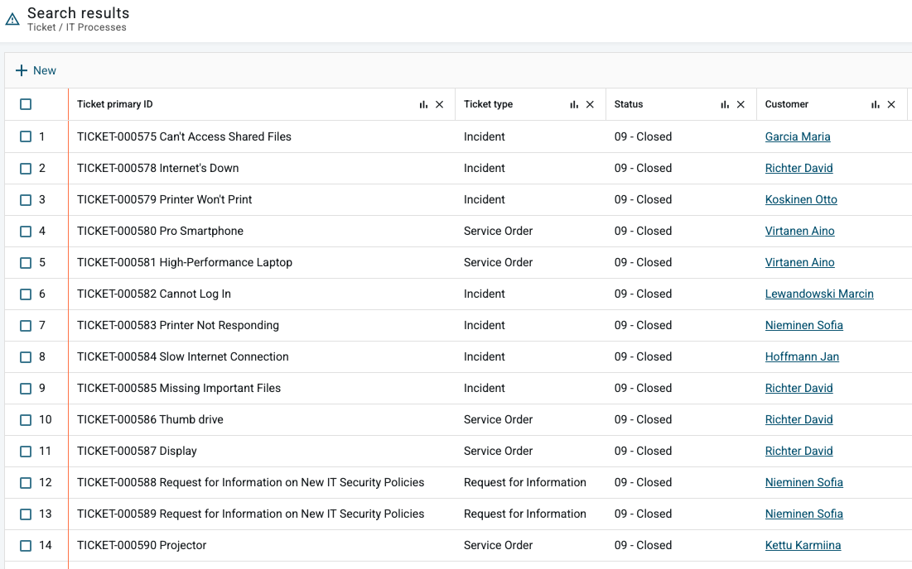

# New Agent UI: Creating graphs from list view

**Källa:** https://community.efecte.com/t/q6yf3fz/new-agent-ui-creating-graphs-from-list-view
**Publicerad:** 2025-03-05T14:05:54.033Z
**Uppdaterad:** 2025-03-05T15:05:54.033000
**Författare:** 

---

New Agent UI: Creating graphs from list view

      
    
          
      

        
              Juha HänninenProduct Owner
            

            ESM Product Owner
              Juha_Hanninen.1
            10 mths agoWed, March 5, 2025 at 3:05 PM GMT+1
  

          

        
    
Problem statement
When viewing reports with a lot of data, it can be hard to understand the bigger picture in just a list format. Building a report on the fly with a single click can help users to pull data and visualize it easily.
 
 
Short description
Graph creation in the new Agent UI is now supported in list views with grouping the data by the values of the selected column. Also, column removal in the list view is introduced
 
Use case details

 Users can create graphs on the fly by clicking the graph icon in the columns of the list view
 The visible data is grouped by the selected attribute
 The graph icon is visible in all list views, for all data types except Text
 The icon is hidden from attributes using following handlers: 
  
   ValueChangeMonitor
   Comment
   Worklog
   EntityStateMail
   FileUpload
   DirectLinkHandler
   ExternalLinkParameters
   ReferrerCounter
   EntitySearch (it should not be visible in list view at all)
   Encryption
  
 Users can remove columns in the list view by clicking the remove icon

 

          
    
        Service Management Tool
      
    
  
  Vote
  Follow

## Bilder

