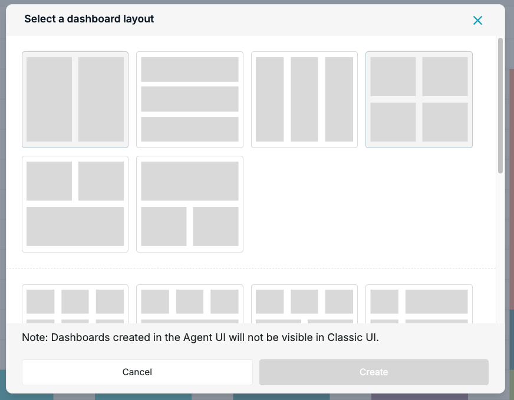

# Agent UI: Dashboard creation with predefined layouts

**Källa:** https://community.efecte.com/t/g9y1tcc/agent-ui-dashboard-creation-with-predefined-layouts
**Publicerad:** 2025-09-03T06:12:32.980Z
**Uppdaterad:** 2025-09-03T08:13:05.700000
**Författare:** 

---

Agent UI: Dashboard creation with predefined layouts

      
    
          
      

        
              Juha HänninenProduct Owner
            

            ESM Product Owner
              Juha_Hanninen.1
            updated 4 mths agoWed, September 3, 2025 at 8:13 AM GMT+2
  

          

        
    
Problem statement 
Currently Agent UI allows only viewing existing dashboards. Users need to be able to create new dashboards for new reporting needs.
 
Short description
Users can create dashboards using predefined layouts in Agent UI. 
 
Use case details

 Dashboard creation in Agent UI is possible with predefined layouts
 Dashboards created in Agent UI are not compatible with Classic UI
 Classic UI dashboards can still be used in Agent UI
 Users can change the views used in the Dashboards as before
 NOTE! Changing the layout is not possible
 NOTE! Adding, removing, or resizing cells is not possible (coming in 2026.1)

 
          
    
        Service Management Tool
      
    
  
  Vote
  Follow

## Bilder

