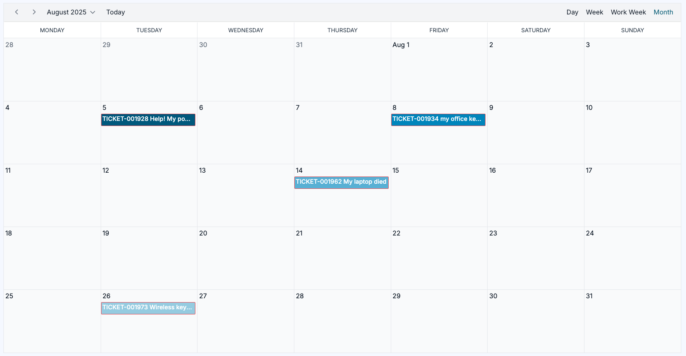

# Agent UI: View support for existing calendar views

**Källa:** https://community.efecte.com/t/83y1tcv/agent-ui-view-support-for-existing-calendar-views
**Publicerad:** 2025-09-03T06:43:06.663Z
**Uppdaterad:** 2025-09-03T08:43:06.663000
**Författare:** 

---

Agent UI: View support for existing calendar views

      
    
          
      

        
              Juha HänninenProduct Owner
            

            ESM Product Owner
              Juha_Hanninen.1
            4 mths agoWed, September 3, 2025 at 8:43 AM GMT+2
  

          

        
    
Problem statement When planning and scheduling work, such as onsite visits or changes, users need to easily see when the work is due, where there are available gaps, and where scheduling conflicts may occur.
 
Short description Users can visualize planned and scheduled work using existing Calendar views in Agent UI
 
Use case details

 Existing calendar views can be visualized in Agent UI
 Users can visualize data in a day, week, work week, or monthly view.
 Users can drill down from the calendar view to the shown data cards
 Users can browse the shown data and easily return to current day

          
    
        Service Management Tool
      
    
  
  Vote
  Follow

## Bilder

