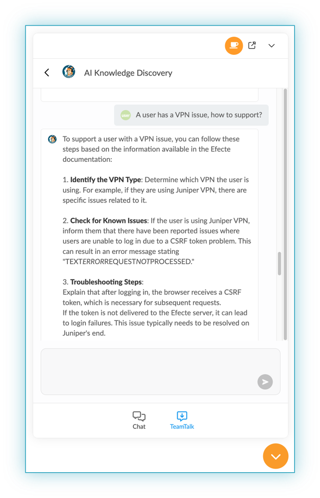
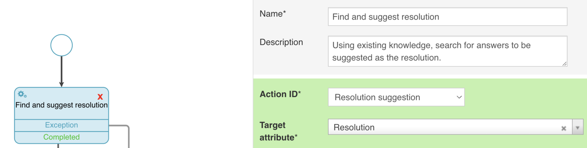
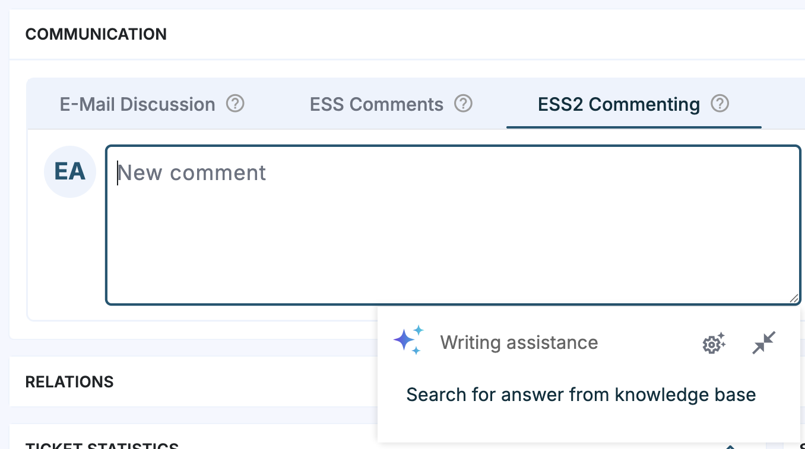
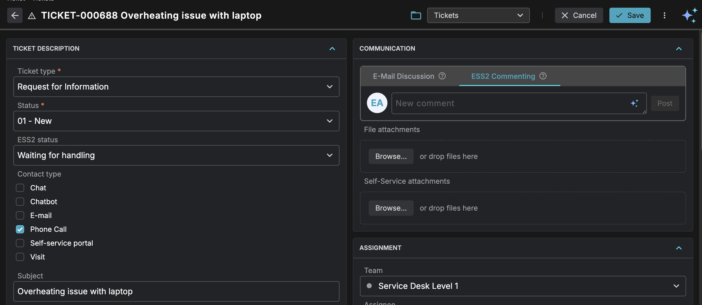

# M42 Core & Pro 2025.3 Highlights

**Källa:** https://community.efecte.com/t/h7y1tc0/m42-core-pro-20253-highlights
**Publicerad:** 2025-09-05T06:06:00.000Z
**Uppdaterad:** 2025-09-16T11:58:01.263000
**Författare:** 

---

M42 Core & Pro 2025.3 Highlights

      
    
          
      

        
              Araceli del Rio SastreEfecte Employee
            

            Product Marketing Director
              Araceli_del_Rio_Sastre
            updated 4 mths agoTue, September 16, 2025 at 11:58 AM GMT+2
  

          2replies
        Juha HänninenProduct Owner3 mths agoTue, October 14, 2025 at 1:43 PM GMT+2
  
        
        

        
    
ContentsWhat's new in Matrix42 Core and Professional 2025.3?Enhanced Service Management capabilitiesRenewed Writing assistanceKnowledge discovery for support agents available in private BetaAgent UI renewalSelf-Service capabilitiesShopping cart and checkout Improved experience on catalog home pageNew supported languagesOther important improvementsConnector managementScheduled tasks for Generic REST API ConnectorScheduled tasks for Google Connector (with Generic REST API Connector)New Raynet Connector (with Generic REST API Connector)Generic SQL Connector improvements
 
We are pleased to announce the release of Matrix42 Core & Professional 2025.3, an update designed to deliver new and enhanced functionalities for improved service management and identity governance. With this release, our goal is to strengthen your operational efficiency, streamline processes, and ensure a more seamless user experience.
For detailed information about all the features, improvements, and bug fixes in the 2025.3 release, please refer to Docs.
If you encounter any issues accessing the link or have questions about upgrading, feel free to contact our service desk at servicedesk@matrix42.com.
What's new in Matrix42 Core and Professional 2025.3?
This release introduces several new innovations and enhancements to empower organizations at every step of their service management and digital transformation journeys, including new AI innovations, improvements in Agent UI, Self-Service, connector management, and new connectors.
Enhanced Service Management capabilities
The 2025.3 release marks a major milestone, introducing conversational AI-powered Knowledge discovery for support agents, a renewed AI-powered Writing assistance, and multiple enhancements to the Agent UI. 
Renewed Writing assistance
A fully renewed AI-powered Writing assistance, the evolution of the former Email assistance, allows Agent UI users to benefit from generative AI in their daily tasks. With configurable admin prompts, the Matrix42 Intelligence Writing assistance reduces the time it takes to document and communicate appropriately according to company policies.
The Writing assistance capability can be configured to allow use cases that help to document, translate, and communicate with high quality and according to company policies, utilizing the available context.

Bug fixes include, for example, fixes for an improved search experience, preventing issues when searching with complex permission schemes and multi-language configurations.
Knowledge discovery for support agents available in private Beta
In release 2025.2 we started piloting Knowledge discovery for end-users. Now we are ready to go one step further to pilot Knowledge discovery for support agents. Agents can use this to quickly find guidelines, troubleshooting steps, and other documentation. They can search across sources: KBs, Confluence, SharePoint, DocuWiki, and more. Users also benefit from natural language queries, so agents can describe the issue with their own words and get relevant answers grounded in the organization's knowledge resources. Knowledge discovery for agents boosts resolution rates, with less manual searching, and instant access to instructions.

Our service management product now allows you to connect Knowledge discovery with Configurable AI in both Writing assistance and Actions. This feature enables M42 Intelligence to first search for existing knowledge before generating answers. As a result, support agents don't even need to ask AI for things that can be found from the knowledge base, such as resolution suggestions for documented solutions. Instead, when they open the ticket for the first time, they can see an AI generated suggestion immediately. 

 
 
This practical integration enhances the speed and accuracy of ticket resolution by leveraging existing knowledge, allowing agents to address customer issues more efficiently. By utilizing insights from past cases, support teams can improve their response times and the quality of their solutions, ultimately leading to better customer satisfaction and productivity.

 
This capability provides a more informed and streamlined support process, giving your team the tools they need to resolve issues quickly and effectively.
We are looking for pilot customers to take on the journey to connect service management agents and automation to existing knowledge, utilizing our Knowledge discovery features that are now available in private Beta for the service management tool. If you are interested in discussing it, please contact your sales representative.
Agent UI renewal
The 2025.3 release introduces a polished, redesigned version of the existing Agent UI. Users can benefit from a visually improved experience that makes it easier to find relevant content. In addition to the redesign, several new features are introduced: new dashboard creation with predefined layouts, view support for existing Calendar views, and Live Chat support, allowing more of your daily tasks to be handled in the Agent UI.

Self-Service capabilities
The Self-Service 2 (ESS2) 2025.3 release introduces new features that enhance usability, including shopping cart and checkout, improved experience on catalog home page, new supported languages and several others.
Shopping cart and checkout 
This self-service release introduces an end-to-end shopping cart flow. When the shopping cart is enabled, Add to Cart replaces instant ordering. Users can add up to 20 items to the cart and see a live badge count in the header. The cart retains its contents between visits, even when switching between browsers or devices (mobile and desktop). A dedicated checkout page summarizes each entry with the item name, delivery time, and price (where applicable), shows an order total when relevant, and lets users expand entries to review submitted form field data. At submission, the system creates separate orders per cart entry.  
Improved experience on catalog home page
The catalog home page now supports visual category tiles by allowing admins to configure a category image. Admins can also highlight a selected category with a featured items carousel at the top of the catalog home page to promote priority offerings. 
New supported languages
The self-service now supports Danish, Norwegian, and Italian.
Other important improvements

 A new, expanded set of icons is available for panels, panel groups, and forms.
 End users see active, unseen announcements in modals when they login to the self-service. 
  
   Note: tracking of unseen announcements is browser-specific.
  
 Search in the self-service user interface has been extended to match categories and include them in results.
 In search results, users see a tag that indicates the entity type: Form, Product Category, or Product Item.
 Managing large permission sets is easier with new filters on checkbox lists when editing access rights across forms, category management, and catalog areas.

Note: there will be later an update package, which will be added to the 2025.3 release, in which we'll bring first multi-language capabilities.
Connector management
Connector management is an integral component of Matrix42 Core, Pro, and IGA solutions. Formerly known as the Efecte Provisioning Engine (EPE), this capability offers a range of out-of-the-box native connectors and provisioning functionalities designed to streamline the integration of various systems and support automated processes.
These native connectors are designed for quick and straightforward configuration. However, it is essential to review the connector documentation to ensure compatibility with your specific use case before implementation.
The 2025.3 release focuses mainly on implementing new native connectors and expanding existing native connectors' functionalities.
Scheduled tasks for Generic REST API Connector
We are excited to introduce Scheduled tasks support for Generic REST API Connector, which already supports event-based tasks. This flexible connector allows seamless integration with external systems, enabling real-time data exchange and process automation within Matrix42 Core, Pro, and IGA environments.
The connector’s authentication capabilities have been enhanced beyond Basic Authentication and Bearer Token Authentication to also support Disabled (for public APIs), Authorization Header, and Dynamic Token. These additions provide broader compatibility with diverse RESTful APIs.
The connector’s scheduled tasks support five different pagination methods, ensuring compatibility with a wide range of third-party APIs: Disabled(no pagination), Start & Offset, Page Increment, Link Token and Link Attribute Token.
This connector enables integrations that can import, create, update, and delete data across external systems, allowing real-time exchange of critical business, service, and asset information as events occur. These capabilities foster more responsive, automated, and data-driven processes throughout the IT landscape.
Generic REST API Connector
Google connector already supported event-based tasks, and in this release we added support also for scheduled tasks.
Now you are also able to import mass amounts of data (e.g. Users and Groups) from Google to M42 Core, Pro and IGA. Google Connector is part of Generic REST API Connector.
Generic REST API Connector
We are excited to introduce Raynet connector. With this connector, you can integrate Raynet solution to M42 Core, Pro and IGA. Raynet Connector is part of Generic REST API Connector. 
You can find information about our partnership with Raynet in the Press Release: Matrix42 and Raynet Form Strategic Partnership for Integrated IT Management Solutions
Generic SQL Connector
For scheduled tasks, this release added support for fetching data from multiple tables, even though those have the same column names. 
For event tasks, this release added support for insert, update and delete SQL clauses.
          
    
        Featured
      
    
  
  Like
  Follow
    
            1

## Bilder

