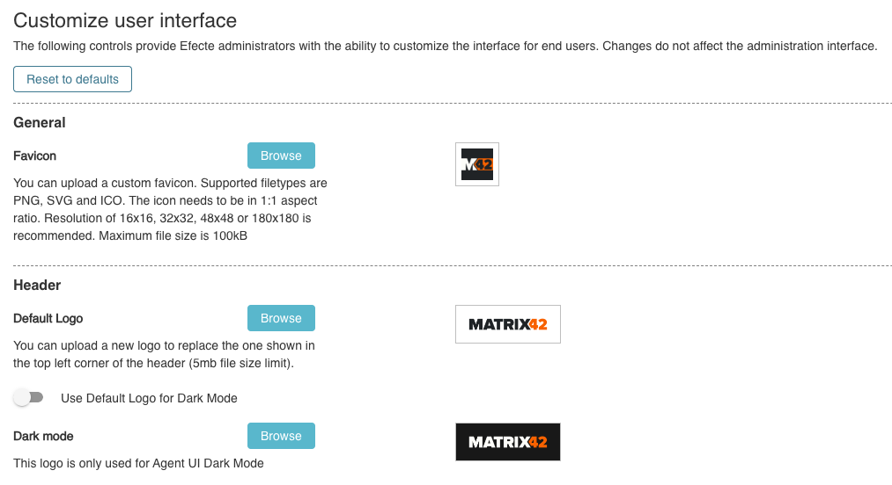

# ESM: Additional custom branding settings

**Källa:** https://community.efecte.com/t/q6yzdf8/esm-additional-custom-branding-settings
**Publicerad:** 2024-11-18T09:24:29.403Z
**Uppdaterad:** 2024-11-18T10:24:29.403000
**Författare:** 

---

ESM: Additional custom branding settings

      
    
          
      

        
              Juha HänninenProduct Owner
            

            ESM Product Owner
              Juha_Hanninen.1
            1 yr agoMon, November 18, 2024 at 10:24 AM GMT+1
  

          

        
    
Problem statement
ESM does not support custom favicons, and dark mode does not have a separate setting for a logo. This makes it hard to customize the UI for all different brands and make ESM identifiable according to the desired look and feel.
 
Short description
As an administrator, I can customize the ESM's favicon and dark mode logo to match our organization's look and feel, making the application more easily identifiable and accessible also in the dark mode.
 
Preview of the change (final version might look slightly different)

 
Use case details
1. It will be possible to add a custom favicon
2. It will be possible to add a separate logo for the dark mode of our new Agent UI
3. Default settings are using new Matrix42 branding
          
    
        Service Management Tool
      
    
  
  Vote
  Follow

## Bilder

