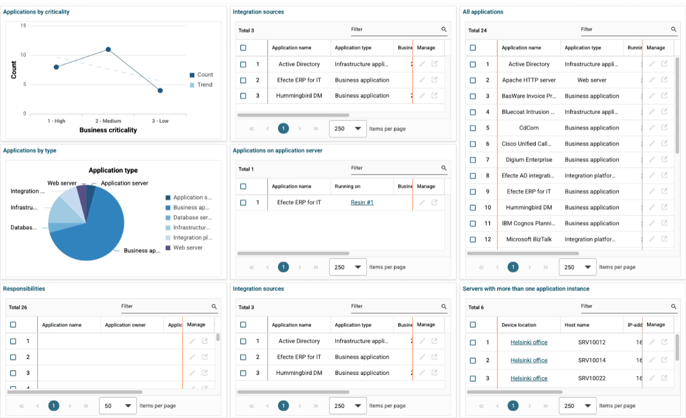

# ESM: View support for dashboards in the new Agent UI

**Källa:** https://community.efecte.com/t/m1yzd1z/esm-view-support-for-dashboards-in-the-new-agent-ui
**Publicerad:** 2024-11-19T06:40:10.563Z
**Uppdaterad:** 2024-11-19T07:40:10.563000
**Författare:** 

---

ESM: View support for dashboards in the new Agent UI

      
    
          
      

        
              Juha HänninenProduct Owner
            

            ESM Product Owner
              Juha_Hanninen.1
            1 yr agoTue, November 19, 2024 at 7:40 AM GMT+1
  

           Released
        

        
    
Problem statement
As a service manager, I want to be able to review all critical metrics using dashboards, to see crucial information in one place.
 
Short description
Dashboards created in the Classic UI will be supported in the Agent UI as view-only.

 
 
Use case details

 It will be possible to view existing dashboards in the new Agent UI
 Following view types are supported: 
  
   Bar chart
   Stacked bar chart
   Clustered bar chart
   Line chart
   Pie chart
   Speedometer
   Status light
   List view
  
 Drill down from graphs is not supported
 Filtering is supported

          
    
        Service Management Tool
      
    
  
  Vote
  Follow
    
            1

## Bilder

