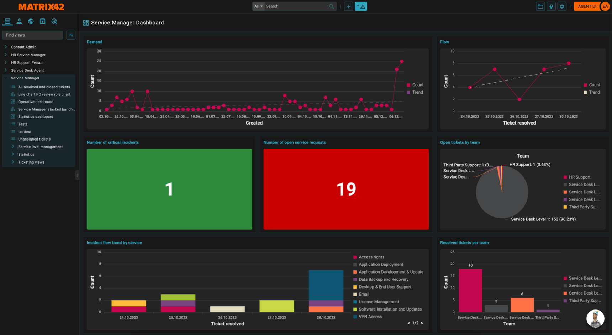
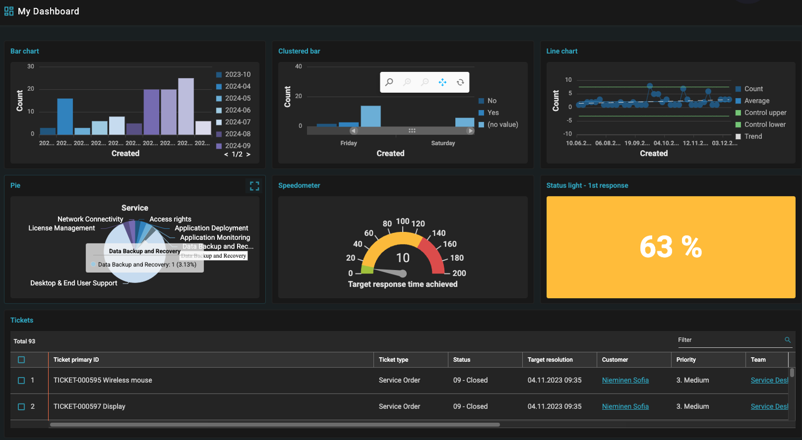

# M42 Core & Pro 2025.1

**Källa:** https://community.efecte.com/t/60ylynb/m42-core-pro-2025-1
**Publicerad:** 2024-12-18T07:14:00.000Z
**Uppdaterad:** 2024-12-20T16:47:15.860000
**Författare:** 

---

M42 Core & Pro 2025.1

      
    
          
      

        
              Araceli del Rio SastreEfecte Employee
            

            Product Marketing Director
              Araceli_del_Rio_Sastre
            updated 1 yr agoFri, December 20, 2024 at 4:47 PM GMT+1
  

          

        
    
ContentsM42 Core & Pro 2025.1 highlightsService Management capabilitiesEffie AI enhancementsAgent UI renewalSelf-Service capabilitiesIdentity Governance and Administration capabilitiesThe Digital Assistant is ready to be rolled out in Europe
 
We are excited to announce the release of Matrix42 Core and Professional 2025.1, along with its release notes. This update introduces new functionalities that enhance AI and UI capabilities, helping customers improve their service management and identity governance experience.
For detailed information about all the features, improvements, and bug fixes in the 2025.1 release, please refer to Docs. If you encounter any issues accessing the link or have questions about upgrading, feel free to contact our service desk at servicedesk@matrix42.com.
Matrix42 Core and Pro (or Professional) refer to the previous Efecte ITSM and Enterprise Service Management offerings. Specifically, Matrix42 Core refers to Efecte ITSM Essentials, while Matrix42 Pro refers to the more advanced Efecte ITSM and Enterprise Service Management solutions.
M42 Core & Pro 2025.1 highlights
Service Management capabilities
With the 2025.1 release, we take a significant step forward by offering EU AI Act-compliant generative AI capabilities in multiple languages, further enhancing the service management experience for our customers. This release also brings substantial improvements across Effie AI, the Agent UI, and general features, including enhancements in platform quality.
Effie AI enhancements
In December 2023, we launched the Matrix42-hosted Large Language Model (LLM), known as Matrix42 GenAI. This model allows customers to leverage generative AI technology without needing to integrate with external services, such as OpenAI. It is specifically optimized for IT Service Management (ITSM) use cases.
With the 2025.1 release, the Matrix42 GenAI model has been enhanced to improve multi-lingual capabilities and ensure compliance with the EU AI Act. It is now based on the Mistral Nemo multilingual model from Mistral AI.
Our objective is to maintain a compact model size while delivering high-quality performance in specialized applications, without expanding its functionality to general-purpose tasks.
Here are some additional enhancements to Effie AI:

 31-day trial for Effie AI for Agents: A trial period is now available, allowing unrestricted use of configurable actions and email assistance. This trial will automatically start in environments where the terms and conditions for Effie AI Email have been accepted. You can use existing OpenAI or Azure OpenAI installations for the trial, in addition to Matrix42 GenAI. Please contact your Matrix42 representative to use Matrix42 GenAI.
 Improvements to Effie AI Email interface: Enhancements based on customer feedback have been made to the email interface.
 Bug fixes: Various bug fixes have been implemented to improve overall performance and user experience.

These updates demonstrate our commitment to continuous improvement and user satisfaction.
Agent UI renewal
The release features improvements in the following areas:

 Ability to view existing dashboards: The new Agent UI supports major reporting views, including the ability to view and edit conditions, basic graphical views in view-only mode, and dashboards.
 Support for all view condition types: This includes support for special condition types and communication attributes in comparisons.
 More supported handlers and datatypes: Nearly all data card handlers are now supported. For example, agents can use automation support to copy data from related data cards with ReferenceCopy handler support and use external links generated by the ExternalLinkParameters handler. Also, External references (links) are now supported. 
 Keyboard accessibility: Enhancements have been made to various UI elements for users who do not have or cannot use a mouse.

The default logos and colors have been updated to align with the Matrix42 brand identity. A separate logo can now be defined for the Dark theme. Custom logos and colors will not be overridden. 
Self-Service capabilities
The Self-Service 2 (ESS2) 2025.1 release introduces new features that enhance usability, including:

 Role-based content: The new self-service can now display forms, panels, panel groups, and URLs based on the user's role. Users can access and report only the cases relevant to them. Administrators can easily define multiple access groups to restrict visibility for different user groups as needed.

 Topical announcements: The new self-service can now display topical announcements to minimize unnecessary contact with the service desk during ongoing maintenance. Once configured, any authorized user can create and publish these announcements to ESS2.
 Dedicated approvals configuration: Every service management process requiring approval can now be managed through self-service. Administrators can set up approvals for various processes independently of catalog and order configurations. For example, HR service request approvals can now be handled in ESS2.

In addition to these new features, Case presentation has been improved to align naming conventions with form fields for enhanced single-language support. This approach helps end-users better understand the case concept when viewing details. Administrators can define more customer-friendly field names for each case presentation configuration.
The new default branding for Matrix42 has also been updated.
Identity Governance and Administration capabilities
The 2025.1 release includes several improvements in the provisioning area, focusing on expanding connector functionalities:

 Enhanced Entra connector capabilities: Ability to fetch data from many new Graph API's and also make subqueries for those. This can be utilized for example by ITSM application to fetch Intune device and Intune software information.
 Enhanced usability of workflow editor orchestration nodes: The "Create User" and "Create Group" nodes have been improved to make them easier to build and maintain.
 Faster implementation and maintenance: With the ability to directly upload Python scripts from the UI, managing the Custom Backend Connector and HR Connector is now more efficient.

For secure access, the 2025.1 version introduces support for:

 Signicat SMS OTP: This feature is now available for Entra users.
 Passwordless Authentication: Implemented via Keycloak using Signicat.

The Digital Assistant is ready to be rolled out in Europe
Jeffie, the new M42 Digital Assistant for Core and Professional users, keeps everyone updated, enhances engagement, and optimizes feedback collection by managing announcements, interactive guides, feedback requests, and tooltips.
Currently, Jeffie is available only in Finnish customer environments. However, with the 2025.1 release and expanded language support, we plan to introduce Jeffie to other environments following the 2024.2 upgrades. The preliminary schedule for this rollout is January 14, 2024.
          
    
        Featured
      
    
  
  Vote
  Follow
    
            2

## Bilder

