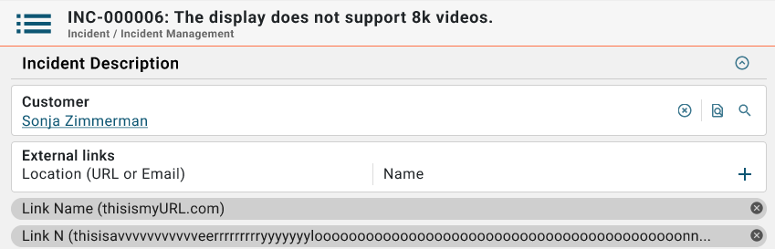

# New Agent UI: External reference support

**Källa:** https://community.efecte.com/t/x2yzhmh/new-agent-ui-external-reference-support
**Publicerad:** 2024-10-11T05:21:41.917Z
**Uppdaterad:** 2024-10-11T07:21:41.917000
**Författare:** 

---

New Agent UI: External reference support

      
    
          
      

        
              Juha HänninenProduct Owner
            

            ESM Product Owner
              Juha_Hanninen.1
            1 yr agoFri, October 11, 2024 at 7:21 AM GMT+2
  

           Released
        

        
    
Problem statement
Currently, in the new Agent UI, External reference works only in view mode.
 
Short description
External references are supported in edit mode.
 
Use case details
In the new Agent UI...

 It will be possible to add links that consist of a name and an URL to data cards
 If the other field does not have a value, it is prepopulated using the same text in the other field
 Multi-value is supported
 Tooltip shows full URL in view mode
 It is not possible to use only whitespaces as characters

 
Illustration of External reference in Edit mode

          
    
        Service Management Tool
      
    
  
  Vote
  Follow

## Bilder

