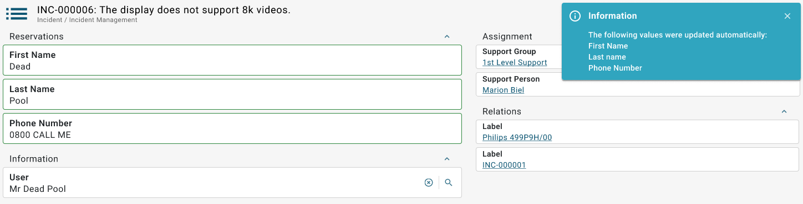

# New Agent UI: ReferenceCopy support

**Källa:** https://community.efecte.com/t/p8ytnwa/new-agent-ui-referencecopy-support
**Publicerad:** 2024-09-18T10:26:17.647Z
**Uppdaterad:** 2024-09-18T12:26:17.647000
**Författare:** 

---

New Agent UI: ReferenceCopy support

      
    
          
      

        
              Juha HänninenProduct Owner
            

            ESM Product Owner
              Juha_Hanninen.1
            1 yr agoWed, September 18, 2024 at 12:26 PM GMT+2
  

           Released
        

        
    
Problem statement 
ReferenceCopy handler allows support agents to fill data card details automatically based on selections on configured reference attributes. This reduces the need for manual entry during handling of data cards. ReferenceCopy is not yet supported in the new Agent UI.
 
Short description
Support for ReferenceCopy is introduced in the new Agent UI
 
 
Use case details

 Existing functionality of ReferenceCopy is supported in the new Agent UI
 Existing configurations don't need any changes when using them in the new Agent UI
 Changes made to data card content by ReferenceCopy handler are highlighted, and mentioned in a notification to make sure information is conveyed to the user.
 Permissions and other functionality works as in the Classic UI

          
    
        Service Management Tool
      
    
  
  Vote
  Follow
    
            1

## Bilder

