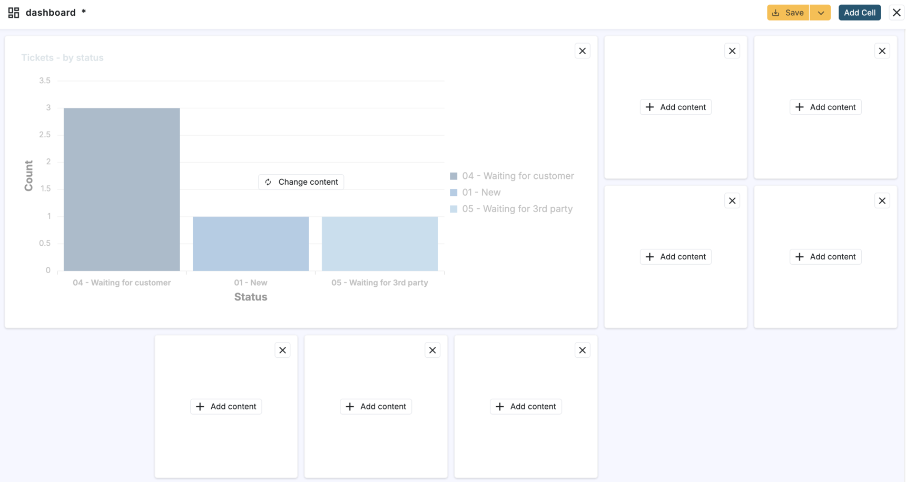

# Agent UI: Adjusting dashboard layout

**Källa:** https://community.efecte.com/t/m1y1zcw/agent-ui-adjusting-dashboard-layout
**Publicerad:** 2025-09-05T17:50:43.743Z
**Uppdaterad:** 2025-09-05T19:50:43.743000
**Författare:** 

---

Agent UI: Adjusting dashboard layout

      
    
          
      

        
              Juha HänninenProduct Owner
            

            ESM Product Owner
              Juha_Hanninen.1
            4 mths agoFri, September 5, 2025 at 7:50 PM GMT+2
  

          

        
    
Problem statement:
To be able to build dashboards for exact user needs, users need full control over dashboard layout.
 
Short description:
Agent UI dashboards are now fully customizable. Users can add and delete cells and adjust cell sizes by dragging them.
 
Use case details:
- Dashboard cells can be resized
- Adding and removing cells is possible
- Max 6 cells can be added per row and column
- Max 18 cells can be added in total in a single dashboard
 

          
    
        Service Management Tool
      
    
  
  Vote
  Follow
    
            1

## Bilder

