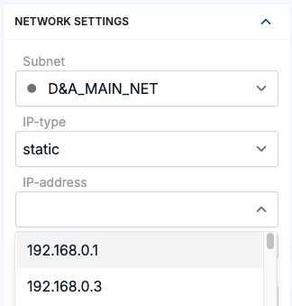

# Agent UI: IPAddress handler support

**Källa:** https://community.efecte.com/t/q6ypkzd/agent-ui-ipaddress-handler-support
**Publicerad:** 2026-01-08T15:03:22.807Z
**Uppdaterad:** 2026-01-08T16:03:22.807000
**Författare:** 

---

Agent UI: IPAddress handler support

      
    
          
      

        
              Juha HänninenProduct Owner
            

            ESM Product Owner
              Juha_Hanninen.1
            11 days agoThu, January 8, 2026 at 4:03 PM GMT+1
  

          

        
    
Problem statement
When dealing with new device CIs, users should be able to easily select an available IP address from the designated IP range. This is currently not possible in the Agent UI.
 
Short description
Using IPAddress handler is now supported in Agent UI.
Use case details

 User can choose free IP addresses in Agent UI when IPAddress handler has been configured
 IPAddress handler works now in Agent UI with existing and new configurations, like in Classic UI with limitations mentioned below.
 Following metadata is not supported or planned currently for Agent UI. 
  
   hasPingButton
   hasAddButton
  

 
Choosing available IP addresses are done simply in a dropdown like in the Classic UI.

          
    
        Service Management Tool
      
    
  
  Vote
  Follow

## Bilder

