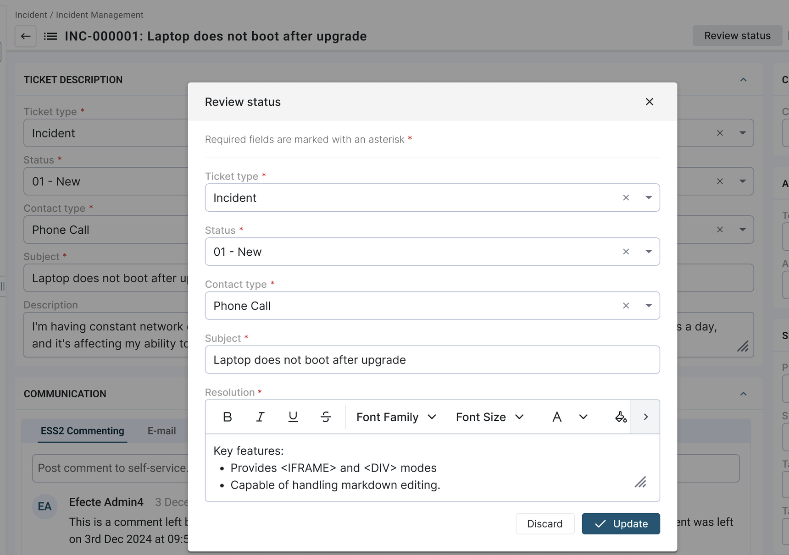

# Agent UI: Quick Actions

**Källa:** https://community.efecte.com/t/35y1llc/agent-ui-quick-actions
**Publicerad:** 2025-09-08T06:10:06.247Z
**Uppdaterad:** 2025-09-08T08:10:06.247000
**Författare:** 

---

Agent UI: Quick Actions

      
    
          
      

        
              Juha HänninenProduct Owner
            

            ESM Product Owner
              Juha_Hanninen.1
            4 mths agoMon, September 8, 2025 at 8:10 AM GMT+2
  

          

        
    
Problem statement
In complex business processes, template configurations are often made very complex to ensure that all necessary data follows the process. However, this means added cognitive load for the users, who need to browse the content and can feel overwhelmed when filling in all the information. Additionally, even if the users know what content to fill in, the necessary attributes can be scattered all over the data card, making it time-consuming to find only a few key attributes, increasing user frustration.
Short description
Quick actions allow users to review contextually relevant attributes in a pop-up configurable by admins, reducing the time it takes to make quick edits to the data cards.
Use case details

 Administrators can define one button per template to initiate quick actions
 Configuration and use are done in Agent UI
 Clicking the configured quick action reserves the data card lock as a normal edit
 The button's name is configurable per template
 In the pop-up, users are only shown attributes for which they have permissions to
 Users can only see actions if they have permissions to at least one of the attributes 
 Attributes using handlers with dependencies to other attributes (like Quick Fill and ReferenceCopy), or "Enable if", cannot be added to the popup

 
Quick actions allow users to edit only contextually relevant attributes, reducing their cognitive load and making it faster to enter crucial inputs. In this example, the administrator has configured a "Review status" action, making it visible for the user in the top right corner to interact with the action.

          
    
        Service Management Tool
      
    
  
  Vote
  Follow
    
            3

## Bilder

