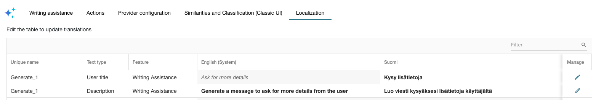
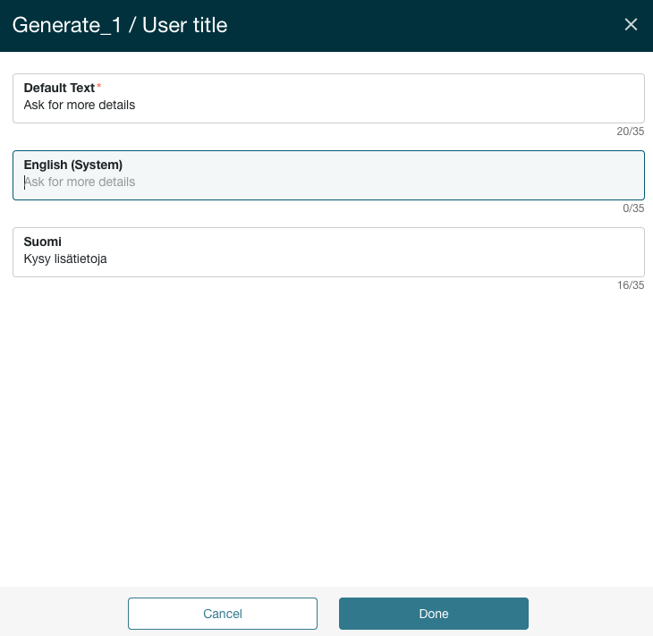

# Pro ESM: Localization of AI configurations

**Källa:** https://community.efecte.com/t/q6ypkzk/pro-esm-localization-of-ai-configurations
**Publicerad:** 2026-01-08T14:44:12.110Z
**Uppdaterad:** 2026-01-08T15:44:12.110000
**Författare:** 

---

Pro ESM: Localization of AI configurations

      
    
          
      

        
              Juha HänninenProduct Owner
            

            ESM Product Owner
              Juha_Hanninen.1
            11 days agoThu, January 8, 2026 at 3:44 PM GMT+1
  

          

        
    
Problem statement
M42 Intelligence features do not support localizations, making it difficult to configure them for multi-lingual teams.
Short description
Localization feature allows admins to create translations for all Writing assistance and Actions configurations.
Use case details

 Localization tab is introduced in the M42 Intelligence admin UI
 Each UI text defined in a M42 Intelligence configuration (like User titles and description) are configurable on a dedicated row
 Admin can identify which configurations have been localized
 Existing texts are used for non-localized texts
 List of configurable languages is based on languages.translation.support platform setting
 Admin can filter to find specific configurations easily

 

          
    
        Service Management Tool
      
    
  
  Vote
  Follow

## Bilder

