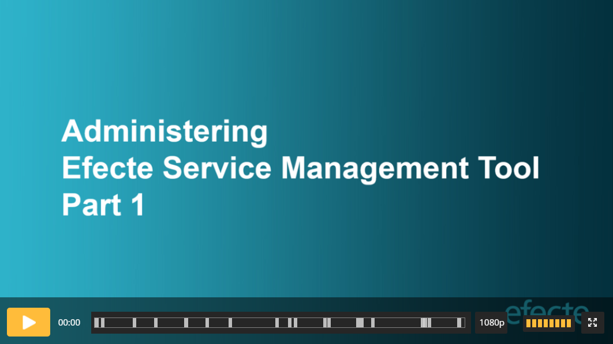

# Administering Efecte Service Management Tool videos

**Källa:** https://community.efecte.com/t/60hm4sf/administering-efecte-service-management-tool-videos
**Publicerad:** 2020-12-07T10:47:47.173Z
**Uppdaterad:** 2025-11-19T08:41:05.293000
**Författare:** 

---

Administering Efecte Service Management Tool videos

      
    

        updated 2 mths agoWed, November 19, 2025 at 8:41 AM GMT+1
  
          

        
    
Introduction: These videos cover all the topics of the Administering Efecte Service Management Tool, which is the basic course for Efecte Service Management (ESM) administrators. Videos provide knowledge for Efecte certification test. Efecte Service Desk requires that the administrator who contacts them is certified. 
Prerequisites: You benefit the most from the videos when you have participated in ESM user course and/or you have user experience.
Goal: Videos provide information and skills required in everyday administering, and they deepen the knowledge obtained during implementation. They prepare you to do ESM certification test. 
Certification test: Test can be done, after you have learned the video content below.  Certification test price is 170€. Please, contact Efecte Academy to schedule the test.
Notice:

 We recommend that you reserve 1 day for each video
 Download the training material
 Video can be paused at your convenience  
 Use video chapters to jump into a specific section

You can use your test environment for practicing. 
 Length: 02:24:06
 Length: 01:47:20
          
    
        Administration
      
    
        Service Management Tool
      
    
        Video
      
    
  
  Like
  
            13

## Bilder

