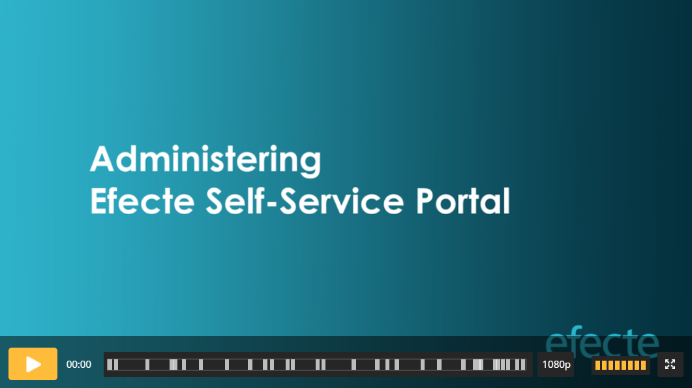

# Administering Self-Service Portal video

**Källa:** https://community.efecte.com/t/m1hvds4/administering-self-service-portal-video
**Publicerad:** 2023-08-16T09:45:04.307Z
**Uppdaterad:** 2025-11-19T09:20:17.920000
**Författare:** 

---

Administering Self-Service Portal video

      
    

        updated 2 mths agoWed, November 19, 2025 at 9:20 AM GMT+1
  
          

        
    
Introduction: This video covers all the topics of the Administering Efecte Self-Service Portal, which is the basic course for Efecte Self-Service Portal (ESS) administrators. Video provides knowledge for Efecte certification test. Efecte Service Desk requires that the administrator who contacts them is certified. 
Prerequisites: None. But you benefit the most from the video when you have participated in Administering ESM training or watched those videos (part 1 & 2).
Goal: Video provides information and skills required in everyday administering, and it deepens the knowledge obtained during implementation. It prepares you to do ESS certification test. 
Certification test: Test can be done, after you have learned the video content below.   Certification test price is 170€. Please, contact Efecte Academy to schedule the test.
Notice:

 We recommend that you reserve 1 day for the video
 Download the training material
 Video can be paused at your convenience  
 Use video chapters to jump into a specific section

You can use your test environment for practicing.  
Length: 03:23:52
          
    
        Self-Service Portal
      
    
        Administration
      
    
        Video
      
    
  
  Like
  Follow

## Bilder

