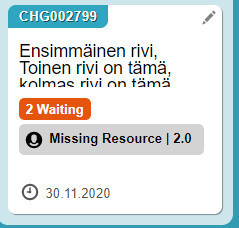

# Kanban and font sizes

**Källa:** https://community.efecte.com/t/60hyhmd/kanban-and-font-sozes
**Publicerad:** 2020-04-02T05:41:06.437Z
**Uppdaterad:** 2020-04-02T13:16:13.963000
**Författare:** 

---

Kanban and font sizes

      
    
          
      

        
              Juha Hotari
            

            
              Juha_Hotari
            updated 5 yrs agoThu, April 2, 2020 at 1:16 PM GMT+2
  

          4replies
        Peter Schneider5 yrs agoThu, April 2, 2020 at 5:29 PM GMT+2
  
        

        
    
 I have used KANBAN -reports now about 3 months daily. There is bad feature in datacard font. The main text font size is not optimised to data field size.  Please make font smaller so that there is possiblity to see 3 lines, not 2,5 line of text.   
          
    
        Kanban
      
    
  
  Vote
  Follow

## Bilder

