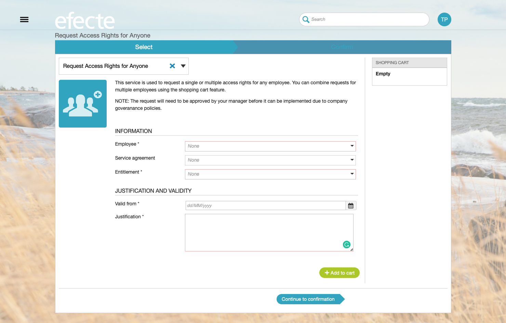

# Make offerings in the self-service portal responsive to better fit the new design

**Källa:** https://community.efecte.com/t/35hyy68/make-offerings-in-the-self-service-portal-responsive-to-better-fit-the-new-design
**Publicerad:** 2020-04-03T08:18:16.650Z
**Uppdaterad:** 2020-04-03T10:20:09.460000
**Författare:** 

---

Make offerings in the self-service portal responsive to better fit the new design

      
    
          
      

        
              Patrick Thurman
            

            Product Manager
              Patrick_Thurman
            updated 5 yrs agoFri, April 3, 2020 at 10:20 AM GMT+2
  

          1reply
        Peter Schneider5 yrs agoTue, July 7, 2020 at 9:03 AM GMT+2
  
        

        
    

      
          

    
        
        
        
      

    

   Make service offerings forms and collector fields responsive to allow more offerings and information to be seen at once and provide a more modern feeling. 
          
    
        Self-Service Portal
      
    
  
  Vote
  Follow
    
            1

## Bilder

