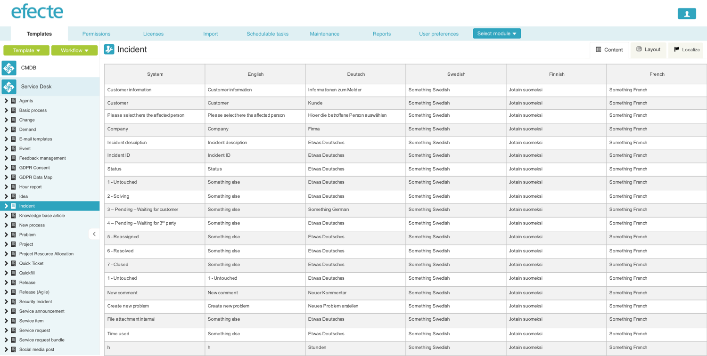

# Multiple Language Support for Service Management Configurations

**Källa:** https://community.efecte.com/t/h4d2rb/multiple-language-support-for-service-management-configurations
**Publicerad:** 2018-12-26T16:36:04.283Z
**Uppdaterad:** 2018-12-26T17:36:04.283000
**Författare:** 

---

Multiple Language Support for Service Management Configurations

      
    
          
      

        
              Peter Schneider
            

            Chief Evangelist / Storyteller
              Peter_Schneider
            7 yrs agoWed, December 26, 2018 at 5:36 PM GMT+1
  

          

        
    

      
          

    
        
        
        
      

    

   As a administrator I want to use Service Management tool in multiple languages, because I cannot maintain the data in different tenants.    
 The templates, list views. graphs, and calendar views must be able to display the configuration texts in the language selected by the user. Translations of the configuration shall be context-orientated i.e. close to the configuration itself (instead of translations in an external tool) in order to achieve a high quality of translations.  All existing systems shall upgrade to the new configuration translation support without customer's interaction and therefore the translations shall be built as additional layer on top the existing configurations and automations. Hence, existing automations such as handlers and listeners will work as is even after the upgrade to the multi-language support. Only the displayed values, which are the result of the automations shall be determined according to the user language preferences. The Administration UI will remain to work in the system language only. 
          
    
        Service Management Tool
      
    
  
  Vote
  Follow
    
            4

## Bilder

