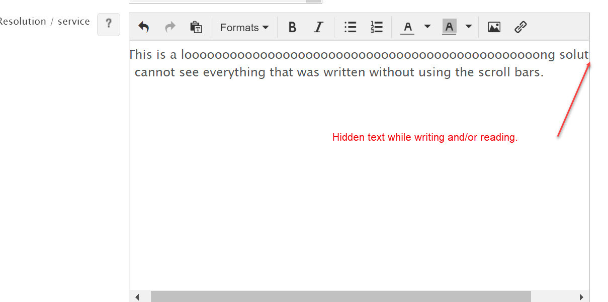

# Rich Text fields: Text not visible till end of line while writing/reading

**Källa:** https://community.efecte.com/t/83hmm8j/rich-text-fields-text-not-visible-till-end-of-line-while-writingreading
**Publicerad:** 2020-11-04T08:52:13.480Z
**Uppdaterad:** 2020-11-04T09:52:13.480000
**Författare:** 

---

Rich Text fields: Text not visible till end of line while writing/reading

      
    
          
      

        
              Oliver Burtscher
            

            
              Oliver_Burtscher
            5 yrs agoWed, November 4, 2020 at 9:52 AM GMT+1
  

          1reply
        Peter Schneider5 yrs agoFri, January 8, 2021 at 12:58 PM GMT+1
  
        

        
    

      
          

    
        
        
        
      

    

   As  a user, when typing into a rich text field, the line break behaviour isn't  user friendly. I cannot see what was written at the right side without using the scroll bars. In the example picture, after the "solut", there's more text.  
 This is not related to the browser used, it happens in all browsers.  
 I'd love to be able to switch off the scroll bars or to have another solution to be able to see the complete text on every line. 
          
  Vote
  Follow
    
            6

## Bilder

